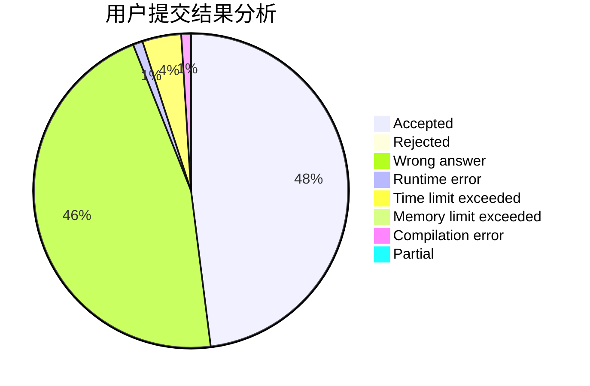
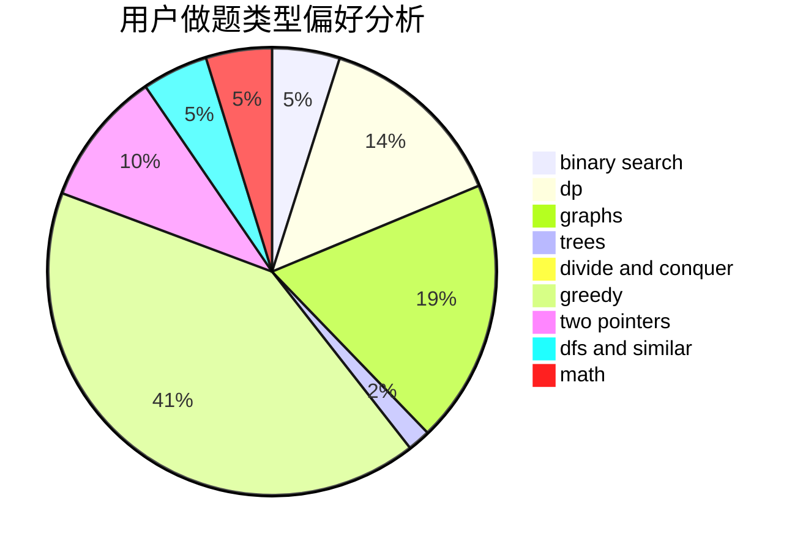

# Binary_Search_Tree

<!-- tabs:start -->

#### **用户提交结果分析**

#### **用户做题类型偏好分析**

<!-- tabs:end -->
# 推荐题目
[1513D](https://codeforces.com/contest/1513/problem/D)
[1027F](https://codeforces.com/contest/1027/problem/F)
[567E](https://codeforces.com/contest/567/problem/E)
[1007A](https://codeforces.com/contest/1007/problem/A)
[567D](https://codeforces.com/contest/567/problem/D)
[1114F](https://codeforces.com/contest/1114/problem/F)
[1065F](https://codeforces.com/contest/1065/problem/F)
[515E](https://codeforces.com/contest/515/problem/E)
[519E](https://codeforces.com/contest/519/problem/E)
[567C](https://codeforces.com/contest/567/problem/C)
