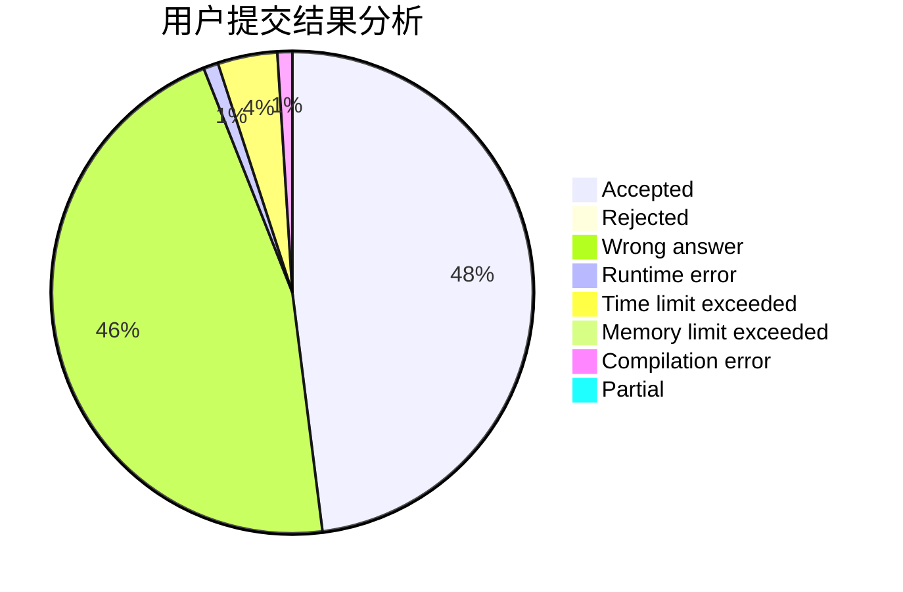
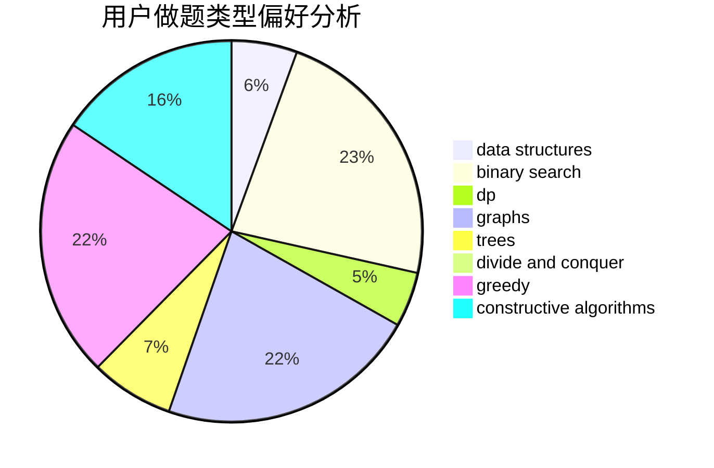
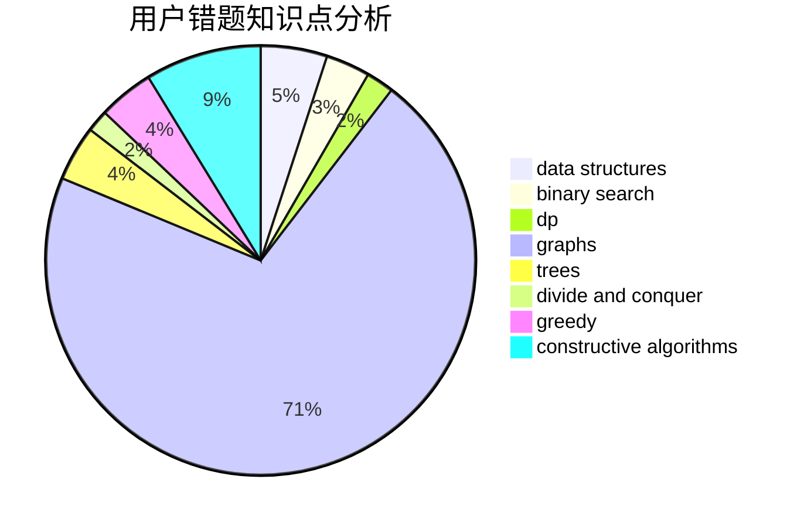

# Binary_Search_Tree

<!-- tabs:start -->

#### **用户提交结果分析**

#### **用户做题类型偏好分析**

#### **用户错题知识点分析**

<!-- tabs:end -->
# 推荐题目
[1504E](https://codeforces.com/contest/1504/problem/E)		dsu,graphs,sortings,trees		  
[1027C](https://codeforces.com/contest/1027/problem/C)		greedy		  
[543C](https://codeforces.com/contest/543/problem/C)		bitmasks,
                        dp		  
[1006D](https://codeforces.com/contest/1006/problem/D)		implementation		  
[543B](https://codeforces.com/contest/543/problem/B)		constructive algorithms,
                        graphs,
                        shortest paths		  
[1114C](https://codeforces.com/contest/1114/problem/C)		brute force,
                        implementation,
                        math,
                        number theory		  
[1065B](https://codeforces.com/contest/1065/problem/B)		constructive algorithms,
                        graphs		  
[496B](https://codeforces.com/contest/496/problem/B)		brute force,
                        constructive algorithms,
                        implementation		  
[498E](https://codeforces.com/contest/498/problem/E)		dp,
                        matrices		  
[543A](https://codeforces.com/contest/543/problem/A)		dp		  
