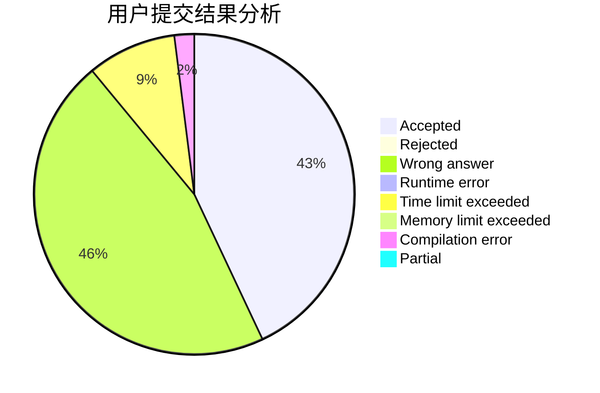
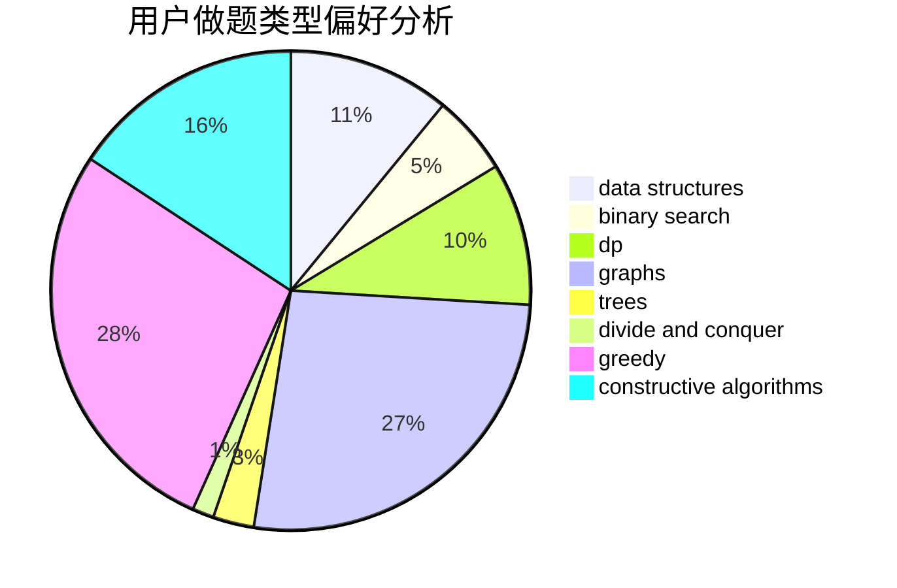
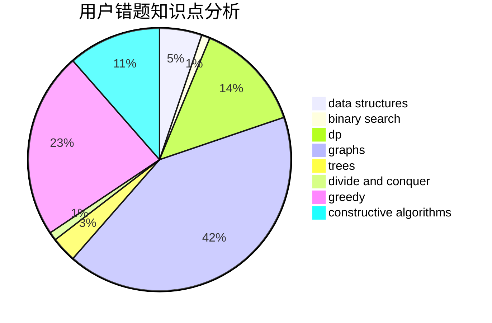

# louroborus

<!-- tabs:start -->

#### **用户提交结果分析**

#### **用户做题类型偏好分析**

#### **用户错题知识点分析**

<!-- tabs:end -->
# 推荐题目
[813D](https://codeforces.com/contest/813/problem/D)		dp,
                        flows		  
[295C](https://codeforces.com/contest/295/problem/C)		combinatorics,
                        dp,
                        graphs,
                        shortest paths		  
[1339E](https://codeforces.com/contest/1339/problem/E)		dsu,graphs,sortings,trees		  
[1033B](https://codeforces.com/contest/1033/problem/B)		math,
                        number theory		  
[1199B](https://codeforces.com/contest/1199/problem/B)		geometry,
                        math		  
[367B](https://codeforces.com/contest/367/problem/B)		binary search,
                        data structures		  
[27D](https://codeforces.com/contest/27/problem/D)		2-sat,
                        dfs and similar,
                        dsu,
                        graphs		  
[1056F](https://codeforces.com/contest/1056/problem/F)		binary search,
                        dp,
                        math		  
[741A](https://codeforces.com/contest/741/problem/A)		dfs and similar,
                        math		  
[872A](https://codeforces.com/contest/872/problem/A)		dsu,graphs,sortings,trees		  
