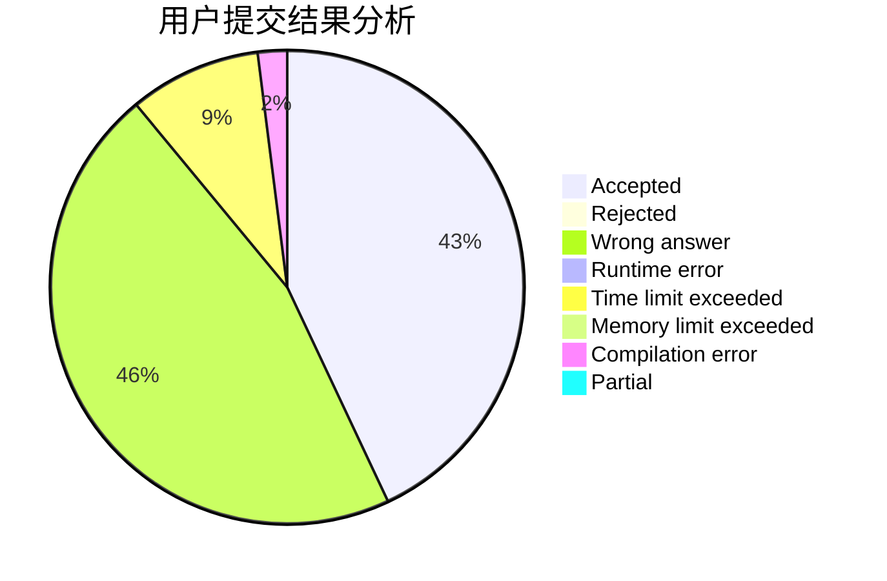
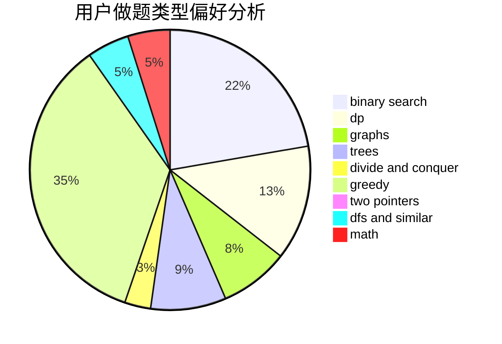

# louroborus

<!-- tabs:start -->

#### **用户提交结果分析**

#### **用户做题类型偏好分析**

<!-- tabs:end -->
# 推荐题目
[831F](https://codeforces.com/contest/831/problem/F)
[312A](https://codeforces.com/contest/312/problem/A)
[1346E](https://codeforces.com/contest/1346/problem/E)
[1033E](https://codeforces.com/contest/1033/problem/E)
[1202F](https://codeforces.com/contest/1202/problem/F)
[398A](https://codeforces.com/contest/398/problem/A)
[295C](https://codeforces.com/contest/295/problem/C)
[1057B](https://codeforces.com/contest/1057/problem/B)
[762A](https://codeforces.com/contest/762/problem/A)
[893C](https://codeforces.com/contest/893/problem/C)
