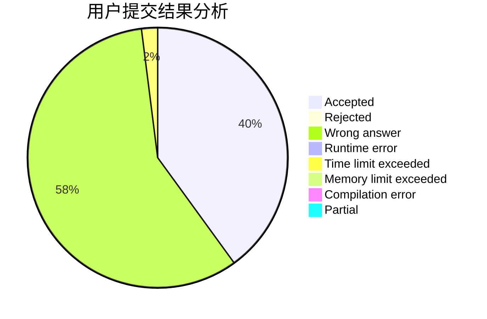
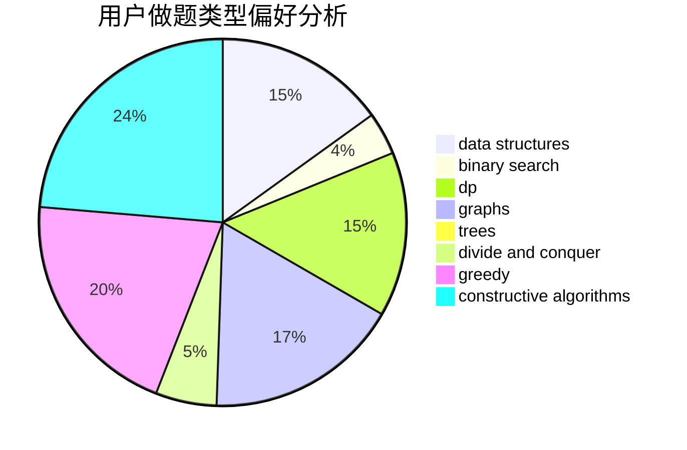
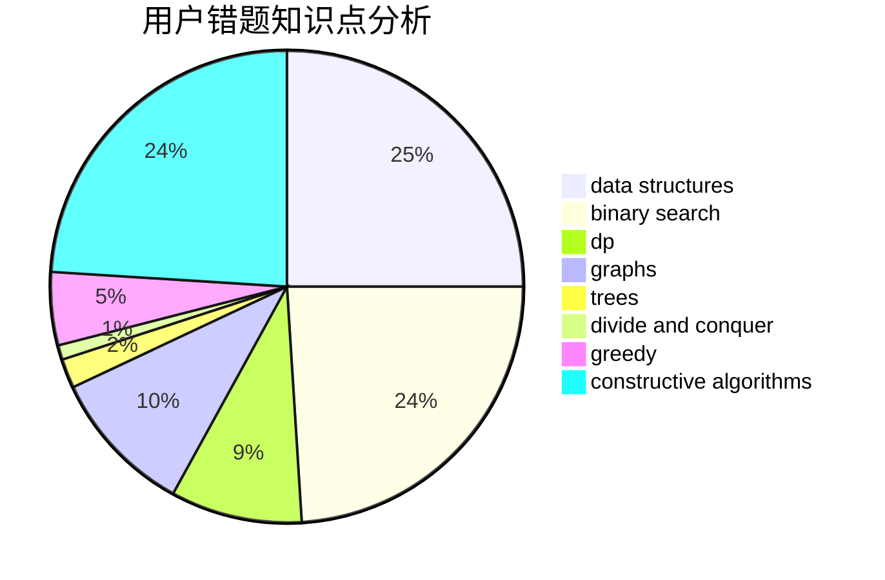

# love_by

<!-- tabs:start -->

#### **用户提交结果分析**

#### **用户做题类型偏好分析**

#### **用户错题知识点分析**

<!-- tabs:end -->
# 推荐题目
[986D](https://codeforces.com/contest/986/problem/D)		fft,
                        math		  
[815C](https://codeforces.com/contest/815/problem/C)		brute force,
                        dp,
                        trees		  
[246E](https://codeforces.com/contest/246/problem/E)		binary search,
                        data structures,
                        dfs and similar,
                        dp,
                        sortings		  
[71A](https://codeforces.com/contest/71/problem/A)		strings		  
[626F](https://codeforces.com/contest/626/problem/F)		dp		  
[1388B](https://codeforces.com/contest/1388/problem/B)		greedy,
                        math		  
[61E](https://codeforces.com/contest/61/problem/E)		data structures,
                        trees		  
[1189E](https://codeforces.com/contest/1189/problem/E)		dsu,graphs,sortings,trees		  
[633D](https://codeforces.com/contest/633/problem/D)		brute force,
                        dp,
                        hashing,
                        implementation,
                        math		  
[290B](https://codeforces.com/contest/290/problem/B)		*special problem,
                        implementation		  
