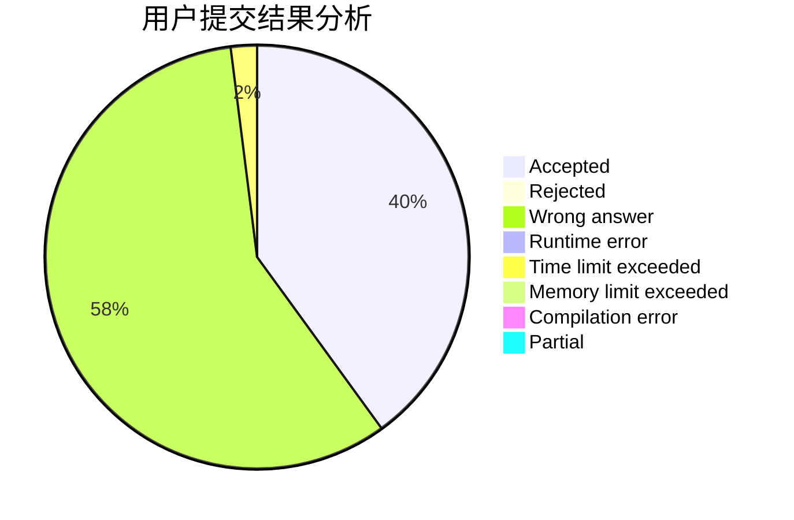
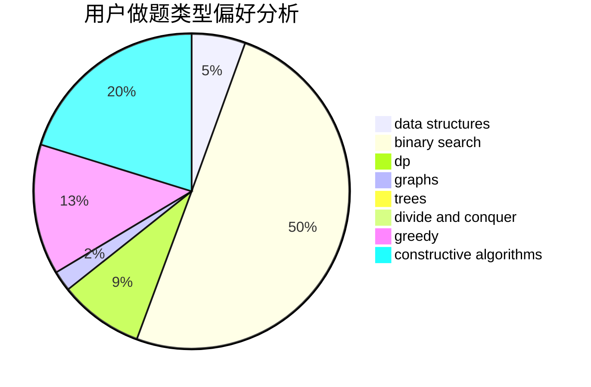
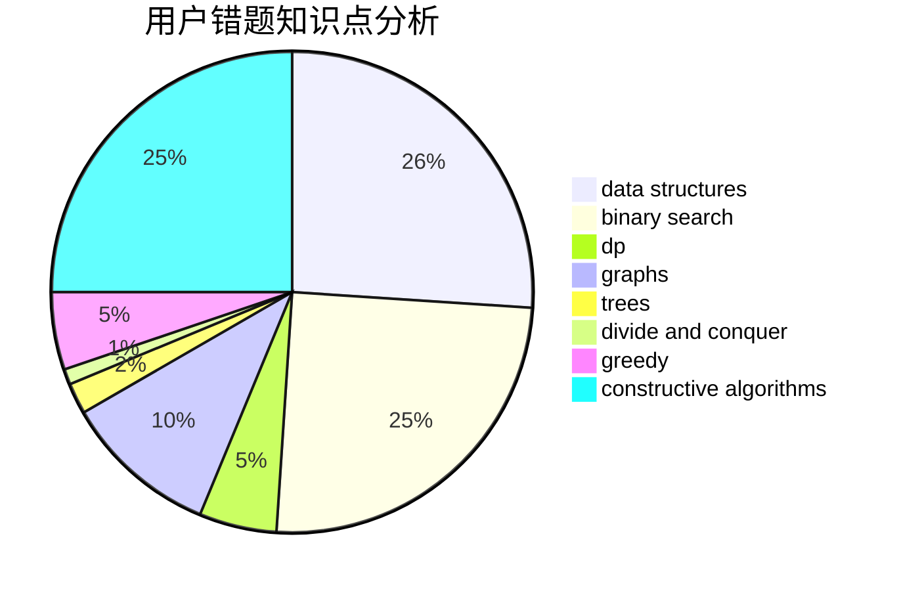

# love_by

<!-- tabs:start -->

#### **用户提交结果分析**

#### **用户做题类型偏好分析**

#### **用户错题知识点分析**

<!-- tabs:end -->
# 推荐题目
[acmsguru6](https://codeforces.com/contest/acmsguru/problem/6)		dsu,graphs,sortings,trees		  
[834C](https://codeforces.com/contest/834/problem/C)		dsu,graphs,sortings,trees		  
[268A](https://codeforces.com/contest/268/problem/A)		brute force		  
[737A](https://codeforces.com/contest/737/problem/A)		dsu,graphs,sortings,trees		  
[653A](https://codeforces.com/contest/653/problem/A)		brute force,
                        implementation,
                        sortings		  
[1397E](https://codeforces.com/contest/1397/problem/E)		dsu,graphs,sortings,trees		  
[641F](https://codeforces.com/contest/641/problem/F)		nan		  
[11952](https://codeforces.com/contest/1195/problem/2)		dsu,graphs,sortings,trees		  
[665F](https://codeforces.com/contest/665/problem/F)		data structures,
                        dp,
                        math,
                        number theory,
                        sortings,
                        two pointers		  
[305B](https://codeforces.com/contest/305/problem/B)		brute force,
                        implementation,
                        math		  
