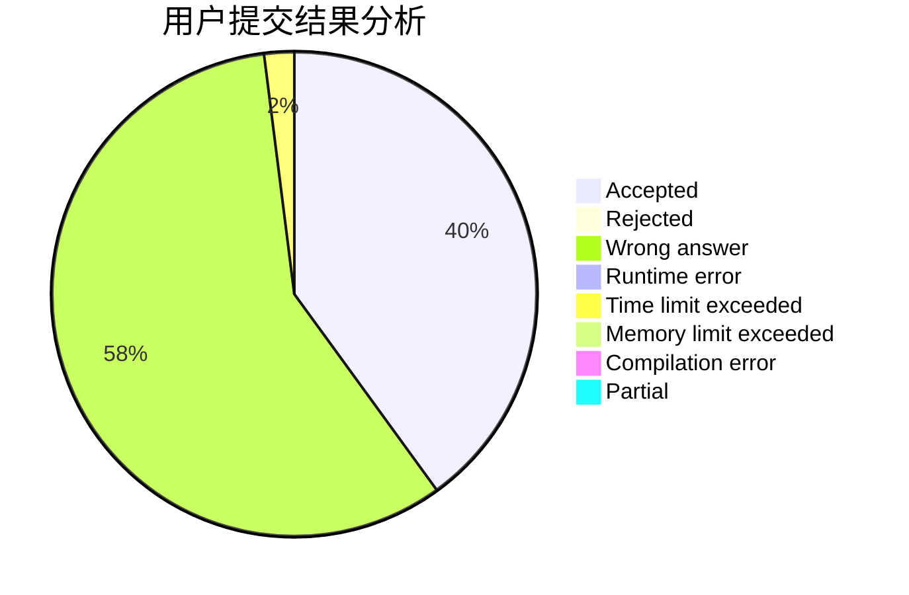
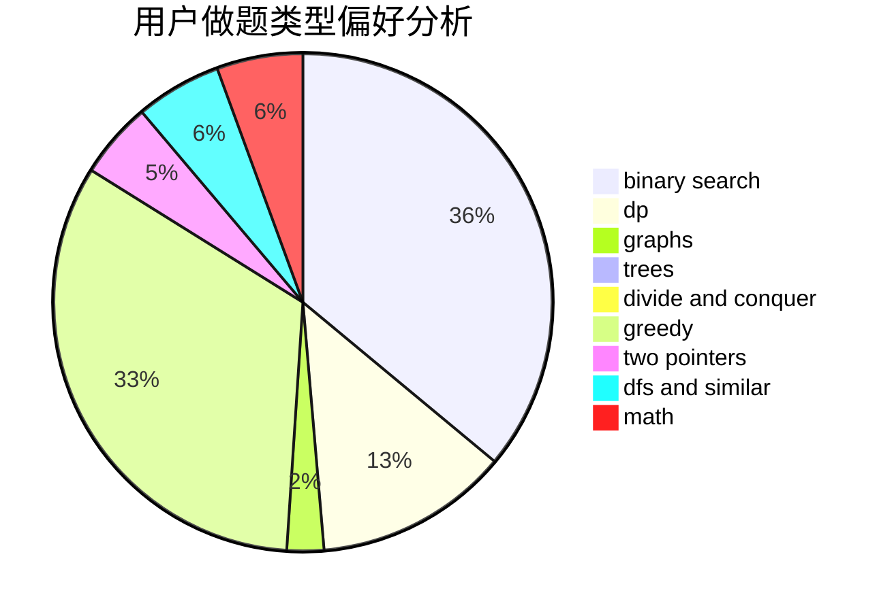

# love_by

<!-- tabs:start -->

#### **用户提交结果分析**

#### **用户做题类型偏好分析**

<!-- tabs:end -->
# 推荐题目
[acmsguru6](https://codeforces.com/contest/acmsguru/problem/6)
[834C](https://codeforces.com/contest/834/problem/C)
[268A](https://codeforces.com/contest/268/problem/A)
[737A](https://codeforces.com/contest/737/problem/A)
[653A](https://codeforces.com/contest/653/problem/A)
[1397E](https://codeforces.com/contest/1397/problem/E)
[641F](https://codeforces.com/contest/641/problem/F)
[11952](https://codeforces.com/contest/1195/problem/2)
[665F](https://codeforces.com/contest/665/problem/F)
[305B](https://codeforces.com/contest/305/problem/B)
