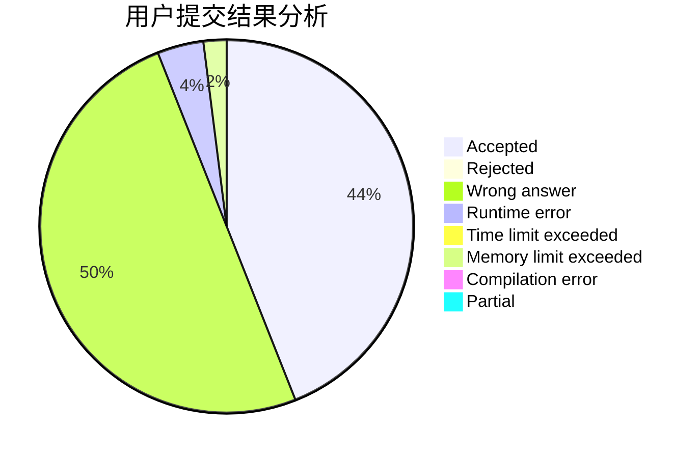
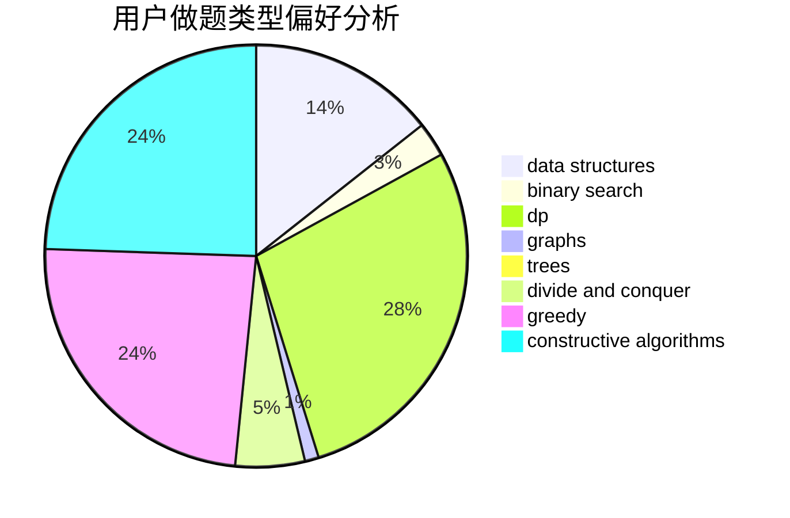

# love_job

<!-- tabs:start -->

#### **用户提交结果分析**

#### **用户做题类型偏好分析**

#### **用户错题知识点分析**

<!-- tabs:end -->
# 推荐题目
[77E](https://codeforces.com/contest/77/problem/E)		geometry		  
[916A](https://codeforces.com/contest/916/problem/A)		brute force,
                        implementation,
                        math		  
[426B](https://codeforces.com/contest/426/problem/B)		implementation		  
[508A](https://codeforces.com/contest/508/problem/A)		brute force		  
[460E](https://codeforces.com/contest/460/problem/E)		brute force,
                        geometry,
                        math,
                        sortings		  
[609A](https://codeforces.com/contest/609/problem/A)		greedy,
                        implementation,
                        sortings		  
[427B](https://codeforces.com/contest/427/problem/B)		data structures,
                        implementation		  
[1137F](https://codeforces.com/contest/1137/problem/F)		data structures,
                        trees		  
[816C](https://codeforces.com/contest/816/problem/C)		dsu,graphs,sortings,trees		  
[1102C](https://codeforces.com/contest/1102/problem/C)		games		  
