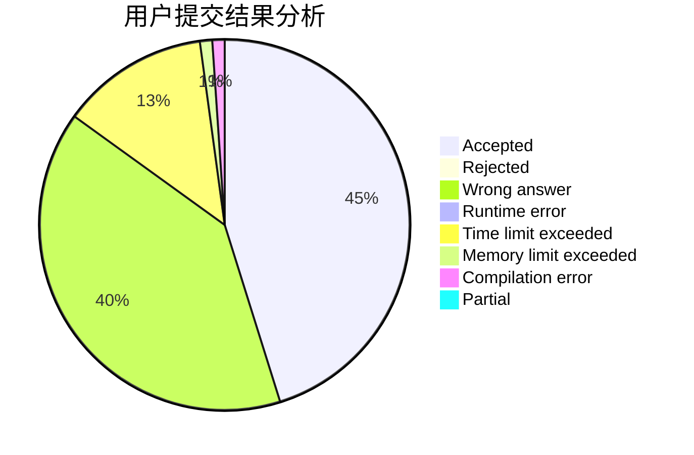
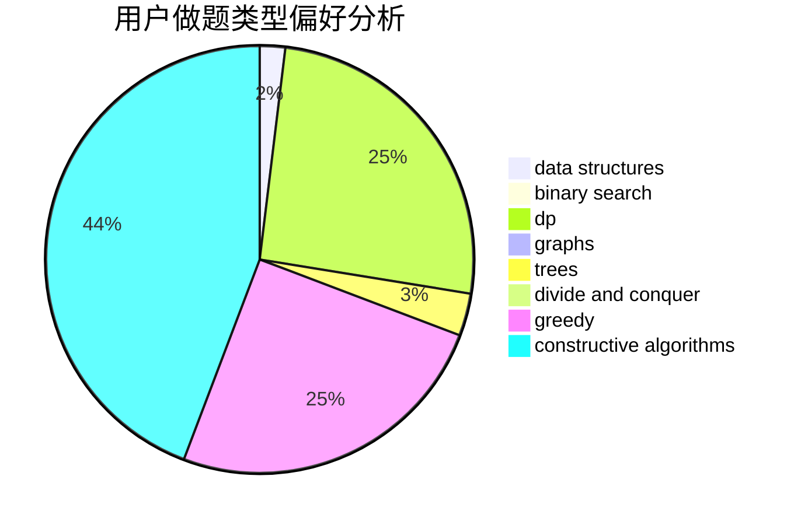
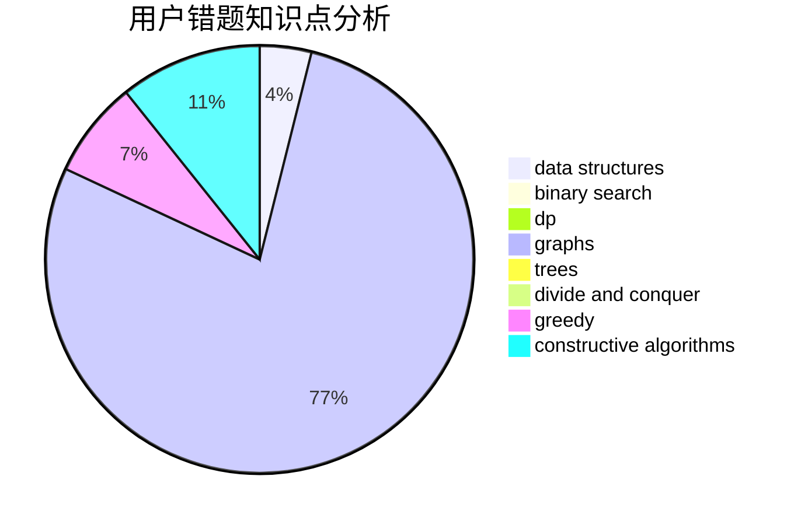

# love_that_girl_forever

<!-- tabs:start -->

#### **用户提交结果分析**

#### **用户做题类型偏好分析**

#### **用户错题知识点分析**

<!-- tabs:end -->
# 推荐题目
[622F](https://codeforces.com/contest/622/problem/F)		math		  
[228B](https://codeforces.com/contest/228/problem/B)		brute force,
                        implementation		  
[868G](https://codeforces.com/contest/868/problem/G)		math		  
[914E](https://codeforces.com/contest/914/problem/E)		bitmasks,
                        data structures,
                        divide and conquer,
                        trees		  
[621E](https://codeforces.com/contest/621/problem/E)		dp,
                        matrices		  
[643D](https://codeforces.com/contest/643/problem/D)		nan		  
[559E](https://codeforces.com/contest/559/problem/E)		dp,
                        sortings		  
[1120C](https://codeforces.com/contest/1120/problem/C)		dp,
                        strings		  
[622C](https://codeforces.com/contest/622/problem/C)		data structures,
                        implementation		  
[818D](https://codeforces.com/contest/818/problem/D)		data structures,
                        implementation		  
