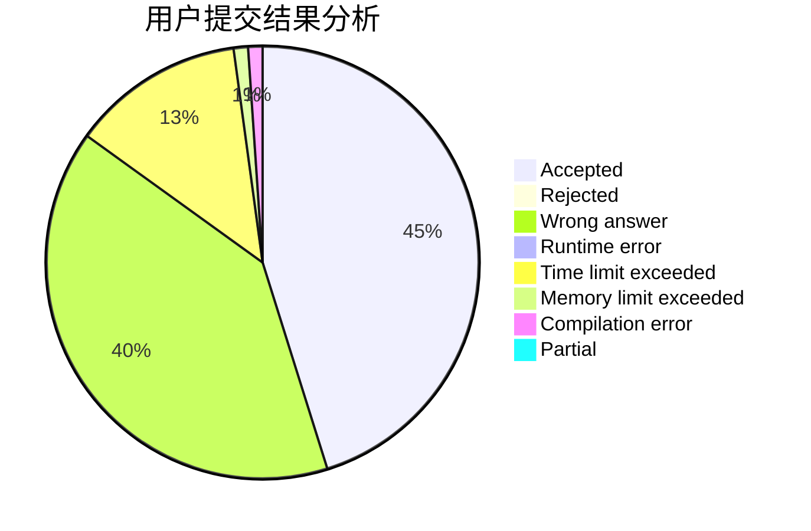
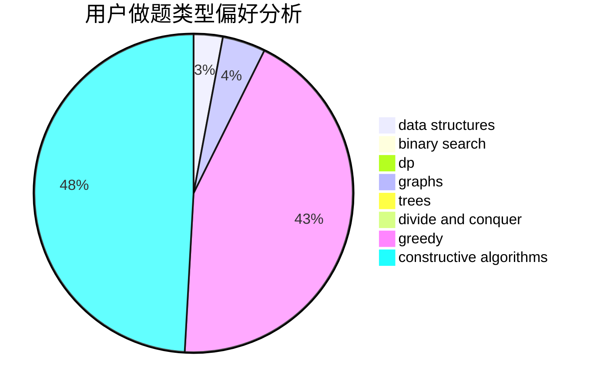
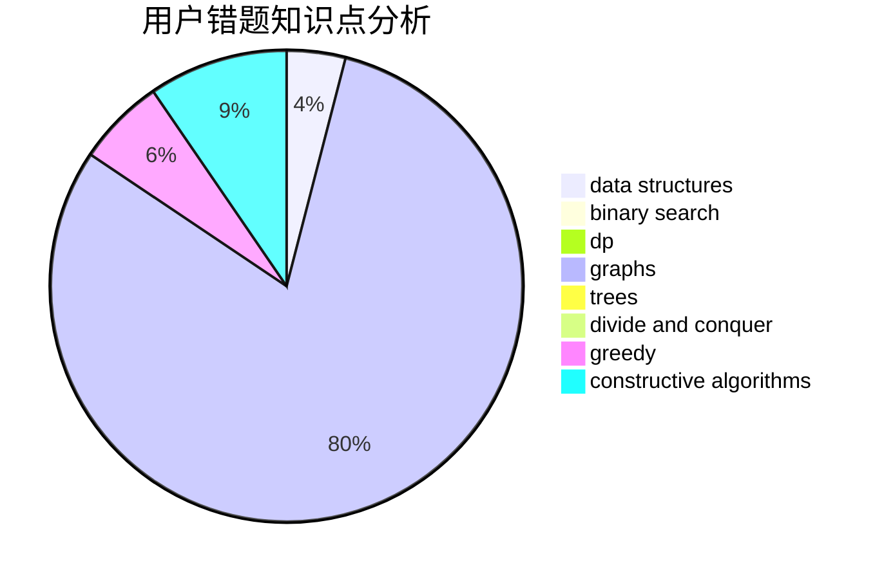

# love_that_girl_forever

<!-- tabs:start -->

#### **用户提交结果分析**

#### **用户做题类型偏好分析**

#### **用户错题知识点分析**

<!-- tabs:end -->
# 推荐题目
[650E](https://codeforces.com/contest/650/problem/E)		data structures,
                        dfs and similar,
                        dsu,
                        greedy,
                        trees		  
[246C](https://codeforces.com/contest/246/problem/C)		brute force,
                        constructive algorithms,
                        greedy		  
[888C](https://codeforces.com/contest/888/problem/C)		binary search,
                        implementation,
                        two pointers		  
[934A](https://codeforces.com/contest/934/problem/A)		brute force,
                        games		  
[645G](https://codeforces.com/contest/645/problem/G)		binary search,
                        geometry		  
[670B](https://codeforces.com/contest/670/problem/B)		implementation		  
[582C](https://codeforces.com/contest/582/problem/C)		number theory		  
[112B](https://codeforces.com/contest/112/problem/B)		implementation,
                        math		  
[650C](https://codeforces.com/contest/650/problem/C)		dfs and similar,
                        dp,
                        dsu,
                        graphs,
                        greedy		  
[838C](https://codeforces.com/contest/838/problem/C)		dp,
                        games		  
