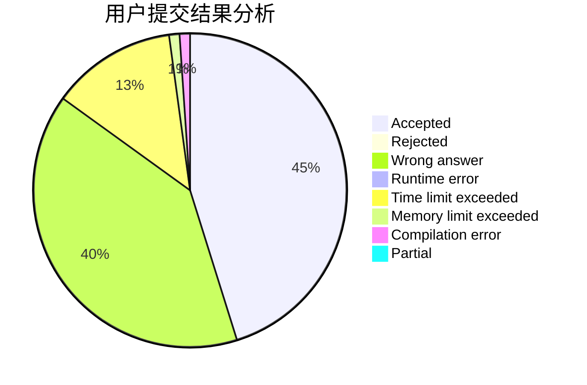
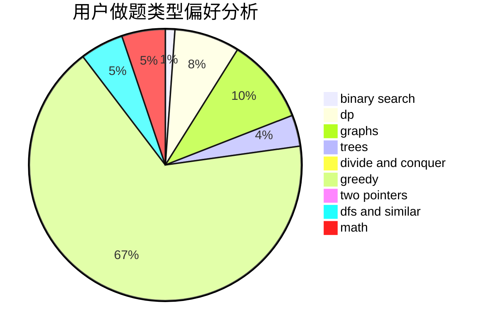

# love_that_girl_forever

<!-- tabs:start -->

#### **用户提交结果分析**

#### **用户做题类型偏好分析**

<!-- tabs:end -->
# 推荐题目
[650E](https://codeforces.com/contest/650/problem/E)
[246C](https://codeforces.com/contest/246/problem/C)
[888C](https://codeforces.com/contest/888/problem/C)
[934A](https://codeforces.com/contest/934/problem/A)
[645G](https://codeforces.com/contest/645/problem/G)
[670B](https://codeforces.com/contest/670/problem/B)
[582C](https://codeforces.com/contest/582/problem/C)
[112B](https://codeforces.com/contest/112/problem/B)
[650C](https://codeforces.com/contest/650/problem/C)
[838C](https://codeforces.com/contest/838/problem/C)
