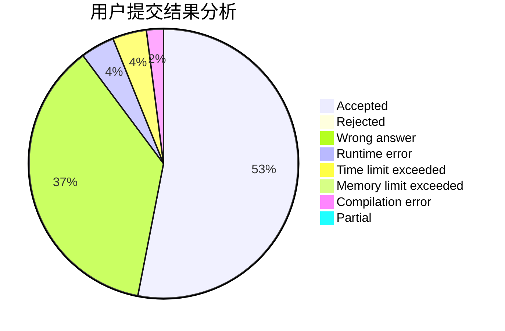
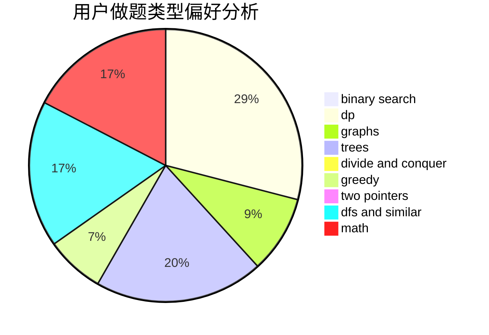

# lovewz

<!-- tabs:start -->

#### **用户提交结果分析**

#### **用户做题类型偏好分析**

<!-- tabs:end -->
# 推荐题目
[1157G](https://codeforces.com/contest/1157/problem/G)
[549E](https://codeforces.com/contest/549/problem/E)
[15C](https://codeforces.com/contest/15/problem/C)
[1182A](https://codeforces.com/contest/1182/problem/A)
[671C](https://codeforces.com/contest/671/problem/C)
[1089A](https://codeforces.com/contest/1089/problem/A)
[1291C](https://codeforces.com/contest/1291/problem/C)
[418C](https://codeforces.com/contest/418/problem/C)
[543D](https://codeforces.com/contest/543/problem/D)
[906E](https://codeforces.com/contest/906/problem/E)
