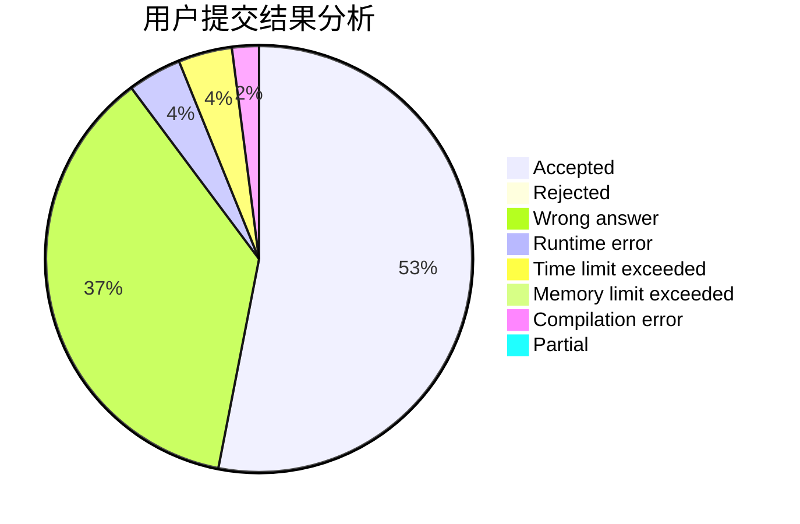
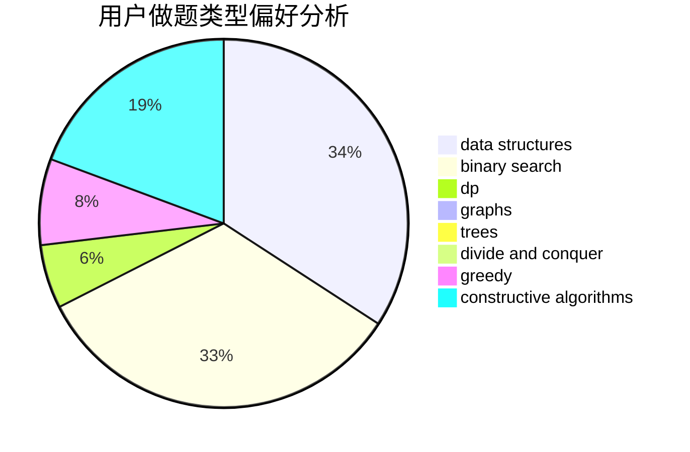

# lovewz

<!-- tabs:start -->

#### **用户提交结果分析**

#### **用户做题类型偏好分析**

#### **用户错题知识点分析**

<!-- tabs:end -->
# 推荐题目
[1156B](https://codeforces.com/contest/1156/problem/B)		dfs and similar,
                        greedy,
                        implementation,
                        sortings,
                        strings		  
[525B](https://codeforces.com/contest/525/problem/B)		constructive algorithms,
                        greedy,
                        math,
                        strings		  
[1509A](https://codeforces.com/contest/1509/problem/A)		constructive algorithms		  
[1179B](https://codeforces.com/contest/1179/problem/B)		constructive algorithms		  
[644A](https://codeforces.com/contest/644/problem/A)		*special problem,
                        constructive algorithms		  
[1088D](https://codeforces.com/contest/1088/problem/D)		bitmasks,
                        constructive algorithms,
                        implementation,
                        interactive		  
[1284C](https://codeforces.com/contest/1284/problem/C)		combinatorics,
                        math		  
[389A](https://codeforces.com/contest/389/problem/A)		greedy,
                        math		  
[516D](https://codeforces.com/contest/516/problem/D)		dfs and similar,
                        dp,
                        dsu,
                        trees,
                        two pointers		  
[887D](https://codeforces.com/contest/887/problem/D)		data structures,
                        two pointers		  
