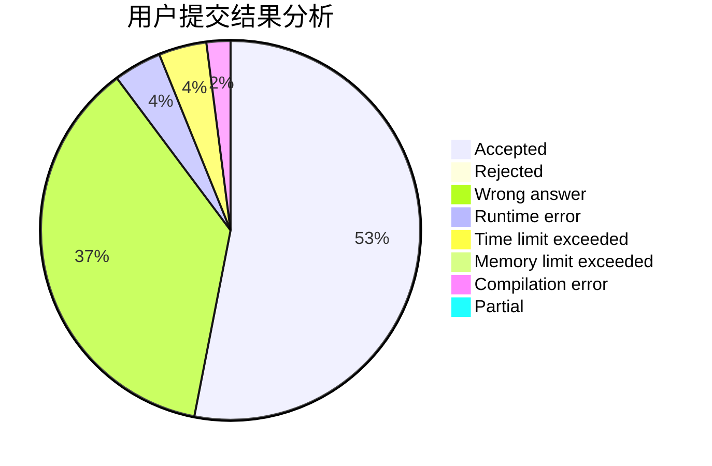
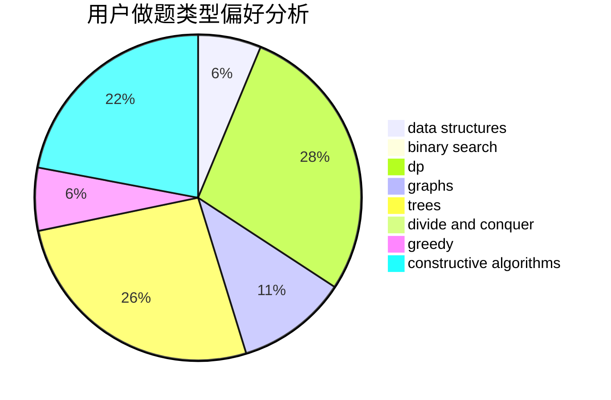
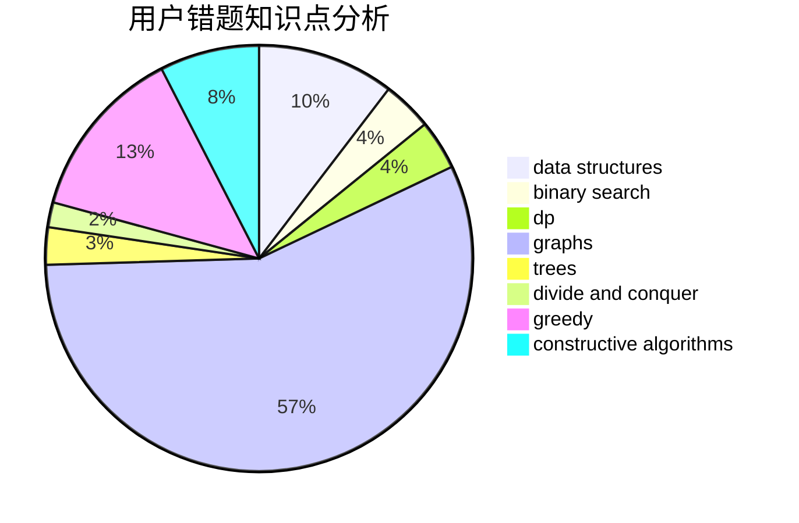

# lovewz

<!-- tabs:start -->

#### **用户提交结果分析**

#### **用户做题类型偏好分析**

#### **用户错题知识点分析**

<!-- tabs:end -->
# 推荐题目
[1157G](https://codeforces.com/contest/1157/problem/G)		brute force,
                        constructive algorithms		  
[549E](https://codeforces.com/contest/549/problem/E)		geometry,
                        math		  
[15C](https://codeforces.com/contest/15/problem/C)		games		  
[1182A](https://codeforces.com/contest/1182/problem/A)		dp,
                        math		  
[671C](https://codeforces.com/contest/671/problem/C)		data structures,
                        number theory		  
[1089A](https://codeforces.com/contest/1089/problem/A)		dp		  
[1291C](https://codeforces.com/contest/1291/problem/C)		dsu,graphs,sortings,trees		  
[418C](https://codeforces.com/contest/418/problem/C)		dsu,graphs,sortings,trees		  
[543D](https://codeforces.com/contest/543/problem/D)		dp,
                        trees		  
[906E](https://codeforces.com/contest/906/problem/E)		dp,
                        string suffix structures,
                        strings		  
