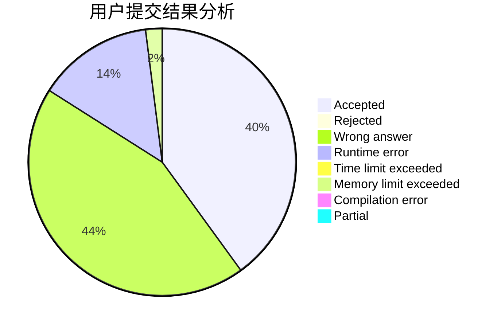
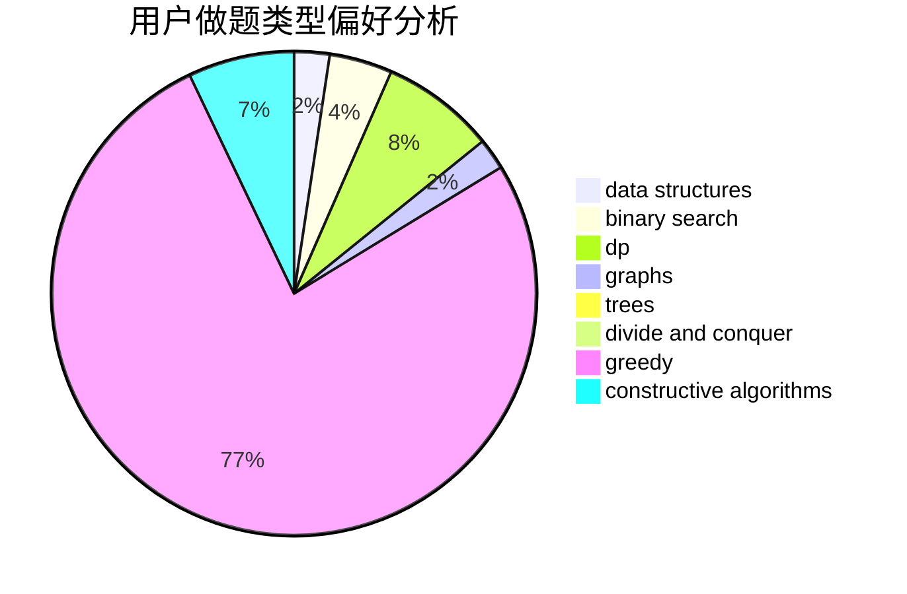

# loveye

<!-- tabs:start -->

#### **用户提交结果分析**

#### **用户做题类型偏好分析**

#### **用户错题知识点分析**

<!-- tabs:end -->
# 推荐题目
[1060A](https://codeforces.com/contest/1060/problem/A)		brute force		  
[715B](https://codeforces.com/contest/715/problem/B)		binary search,
                        constructive algorithms,
                        graphs,
                        shortest paths		  
[936A](https://codeforces.com/contest/936/problem/A)		binary search,
                        implementation,
                        math		  
[551A](https://codeforces.com/contest/551/problem/A)		brute force,
                        implementation,
                        sortings		  
[1251B](https://codeforces.com/contest/1251/problem/B)		greedy,
                        strings		  
[114B](https://codeforces.com/contest/114/problem/B)		bitmasks,
                        brute force,
                        graphs		  
[1508C](https://codeforces.com/contest/1508/problem/C)		data structures,
                        dfs and similar,
                        dsu,
                        graphs,
                        greedy,
                        math		  
[1415F](https://codeforces.com/contest/1415/problem/F)		dp		  
[1146A](https://codeforces.com/contest/1146/problem/A)		implementation,
                        strings		  
[1214D](https://codeforces.com/contest/1214/problem/D)		dfs and similar,
                        dp,
                        flows,
                        hashing		  
