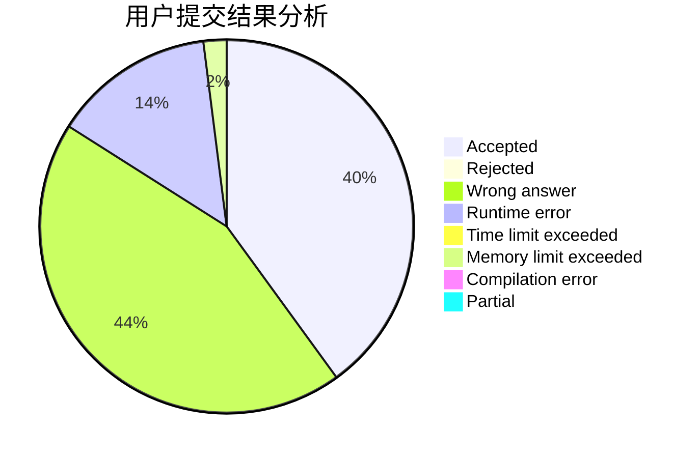
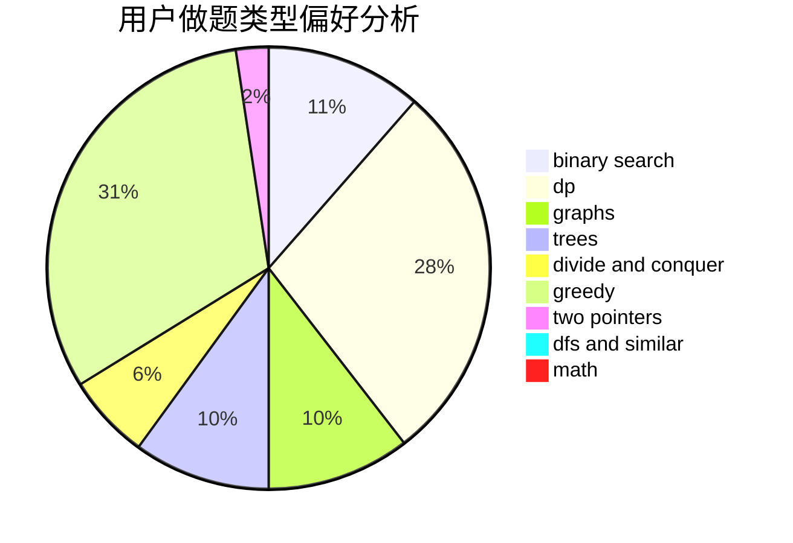

# loveye

<!-- tabs:start -->

#### **用户提交结果分析**

#### **用户做题类型偏好分析**

<!-- tabs:end -->
# 推荐题目
[1060D](https://codeforces.com/contest/1060/problem/D)
[733D](https://codeforces.com/contest/733/problem/D)
[9581](https://codeforces.com/contest/958/problem/1)
[576A](https://codeforces.com/contest/576/problem/A)
[1256C](https://codeforces.com/contest/1256/problem/C)
[1151E](https://codeforces.com/contest/1151/problem/E)
[15A](https://codeforces.com/contest/15/problem/A)
[1423J](https://codeforces.com/contest/1423/problem/J)
[1148A](https://codeforces.com/contest/1148/problem/A)
[121E](https://codeforces.com/contest/121/problem/E)
