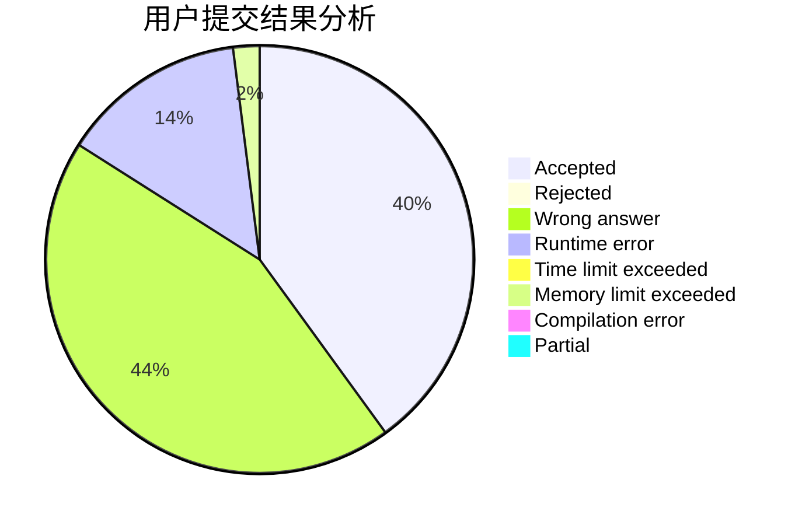
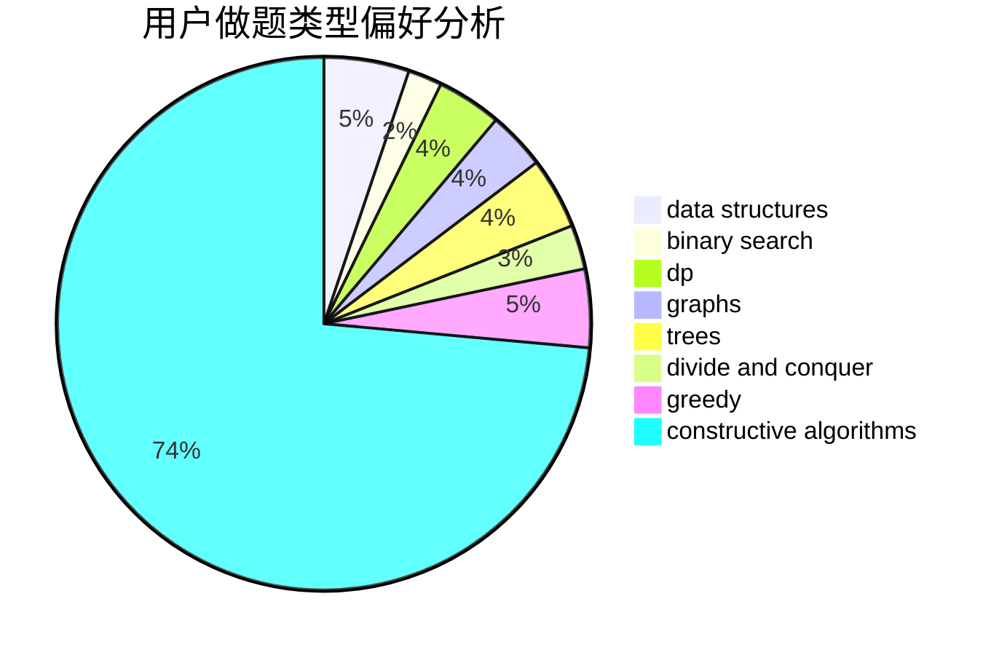

# loveye

<!-- tabs:start -->

#### **用户提交结果分析**

#### **用户做题类型偏好分析**

#### **用户错题知识点分析**

<!-- tabs:end -->
# 推荐题目
[1060D](https://codeforces.com/contest/1060/problem/D)		greedy,
                        math		  
[733D](https://codeforces.com/contest/733/problem/D)		data structures,
                        hashing		  
[9581](https://codeforces.com/contest/958/problem/1)		dsu,graphs,sortings,trees		  
[576A](https://codeforces.com/contest/576/problem/A)		math,
                        number theory		  
[1256C](https://codeforces.com/contest/1256/problem/C)		greedy		  
[1151E](https://codeforces.com/contest/1151/problem/E)		combinatorics,
                        data structures,
                        dp,
                        math		  
[15A](https://codeforces.com/contest/15/problem/A)		implementation,
                        sortings		  
[1423J](https://codeforces.com/contest/1423/problem/J)		bitmasks,
                        constructive algorithms,
                        dp,
                        math		  
[1148A](https://codeforces.com/contest/1148/problem/A)		greedy		  
[121E](https://codeforces.com/contest/121/problem/E)		data structures		  
