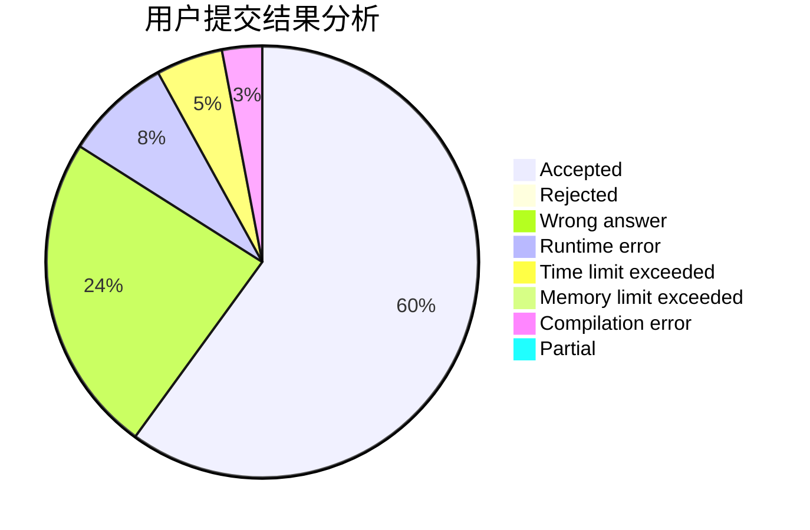
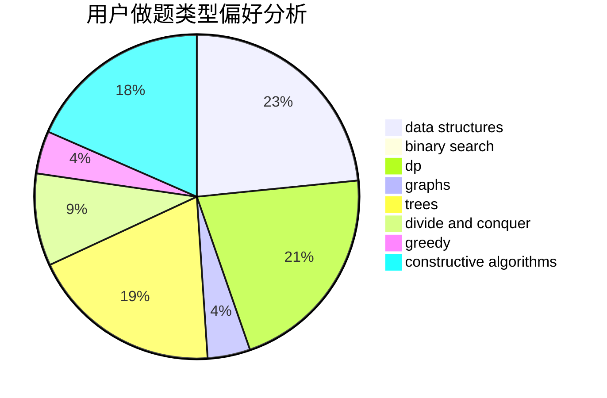

# lqs2015

<!-- tabs:start -->

#### **用户提交结果分析**

#### **用户做题类型偏好分析**

#### **用户错题知识点分析**

<!-- tabs:end -->
# 推荐题目
[1060F](https://codeforces.com/contest/1060/problem/F)		combinatorics,
                        dp		  
[1457D](https://codeforces.com/contest/1457/problem/D)		dsu,graphs,sortings,trees		  
[1174E](https://codeforces.com/contest/1174/problem/E)		combinatorics,
                        dp,
                        math,
                        number theory		  
[1103D](https://codeforces.com/contest/1103/problem/D)		bitmasks,
                        dp		  
[35A](https://codeforces.com/contest/35/problem/A)		implementation		  
[226B](https://codeforces.com/contest/226/problem/B)		greedy		  
[260B](https://codeforces.com/contest/260/problem/B)		brute force,
                        implementation,
                        strings		  
[216B](https://codeforces.com/contest/216/problem/B)		dfs and similar,
                        implementation		  
[230B](https://codeforces.com/contest/230/problem/B)		binary search,
                        implementation,
                        math,
                        number theory		  
[301D](https://codeforces.com/contest/301/problem/D)		data structures		  
