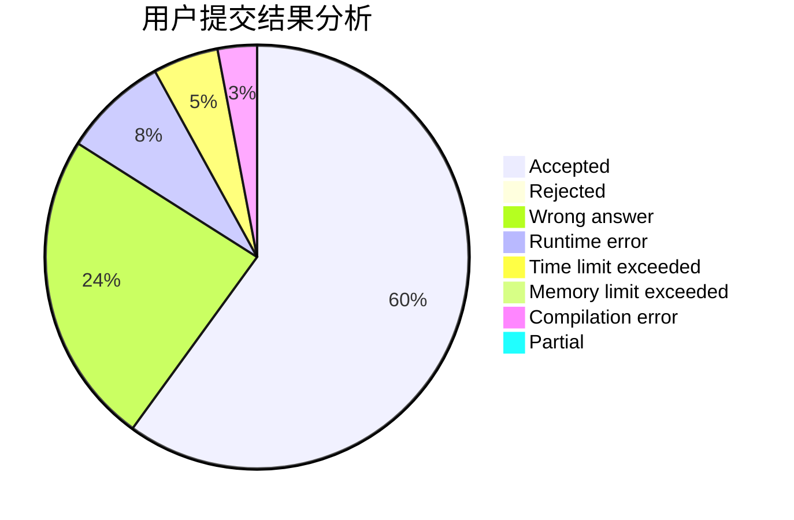
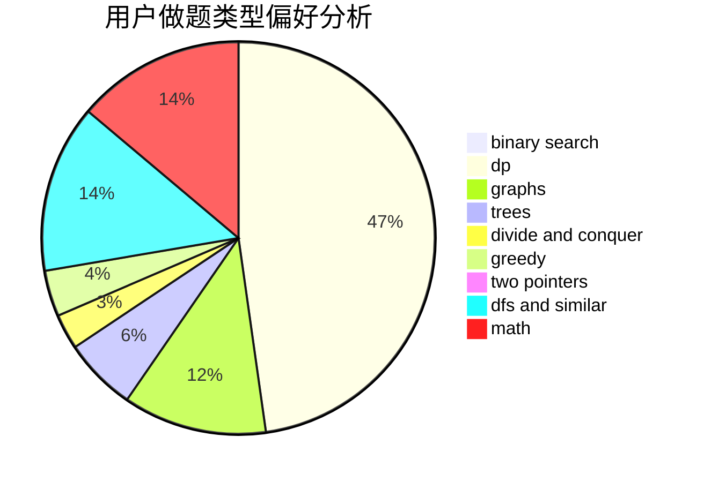

# lqs2015

<!-- tabs:start -->

#### **用户提交结果分析**

#### **用户做题类型偏好分析**

<!-- tabs:end -->
# 推荐题目
[1060F](https://codeforces.com/contest/1060/problem/F)
[1457D](https://codeforces.com/contest/1457/problem/D)
[1174E](https://codeforces.com/contest/1174/problem/E)
[1103D](https://codeforces.com/contest/1103/problem/D)
[35A](https://codeforces.com/contest/35/problem/A)
[226B](https://codeforces.com/contest/226/problem/B)
[260B](https://codeforces.com/contest/260/problem/B)
[216B](https://codeforces.com/contest/216/problem/B)
[230B](https://codeforces.com/contest/230/problem/B)
[301D](https://codeforces.com/contest/301/problem/D)
