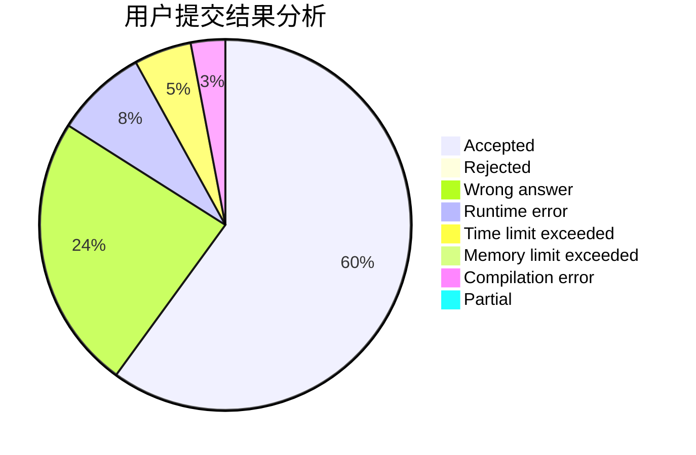
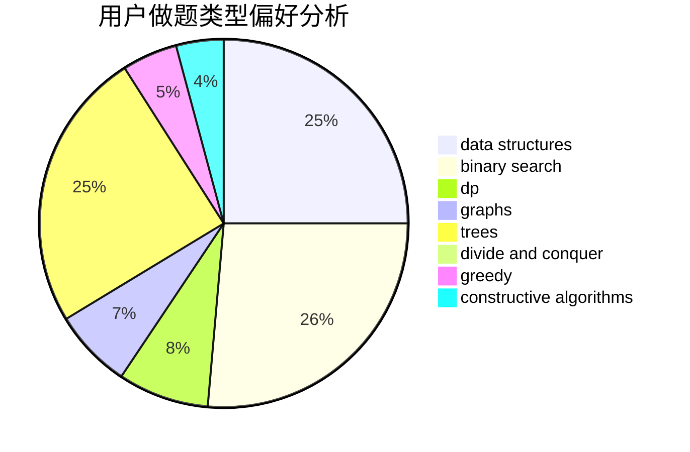

# lqs2015

<!-- tabs:start -->

#### **用户提交结果分析**

#### **用户做题类型偏好分析**

#### **用户错题知识点分析**

<!-- tabs:end -->
# 推荐题目
[1060C](https://codeforces.com/contest/1060/problem/C)		binary search,
                        implementation,
                        two pointers		  
[1447F2](https://codeforces.com/contest/1447F/problem/2)		dsu,graphs,sortings,trees		  
[1172C1](https://codeforces.com/contest/1172C/problem/1)		dp,
                        probabilities		  
[1103A](https://codeforces.com/contest/1103/problem/A)		constructive algorithms,
                        implementation		  
[331E1](https://codeforces.com/contest/331E/problem/1)		constructive algorithms,
                        graphs,
                        implementation		  
[201C](https://codeforces.com/contest/201/problem/C)		dp		  
[238E](https://codeforces.com/contest/238/problem/E)		dp,
                        graphs,
                        shortest paths		  
[193A](https://codeforces.com/contest/193/problem/A)		constructive algorithms,
                        graphs,
                        trees		  
[208D](https://codeforces.com/contest/208/problem/D)		implementation		  
[288C](https://codeforces.com/contest/288/problem/C)		implementation,
                        math		  
