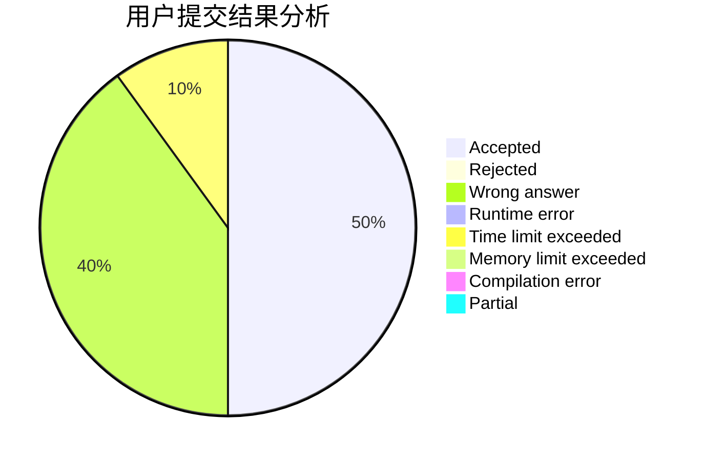
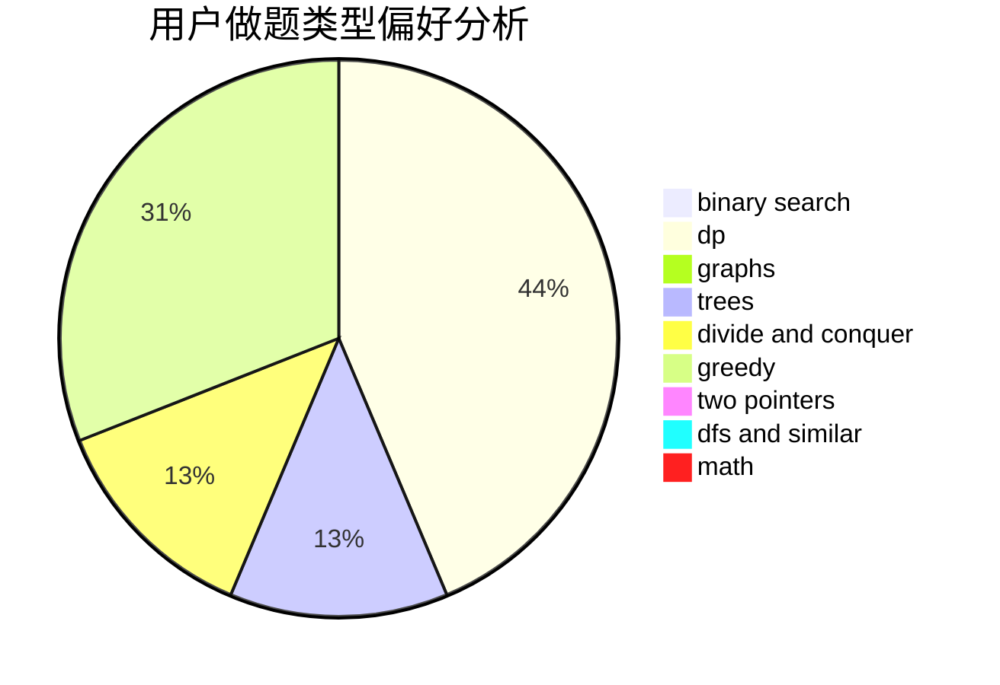

# lqx123123

<!-- tabs:start -->

#### **用户提交结果分析**

#### **用户做题类型偏好分析**

<!-- tabs:end -->
# 推荐题目
[1380G](https://codeforces.com/contest/1380/problem/G)
[466A](https://codeforces.com/contest/466/problem/A)
[1347D](https://codeforces.com/contest/1347/problem/D)
[158C](https://codeforces.com/contest/158/problem/C)
[37B](https://codeforces.com/contest/37/problem/B)
[1165D](https://codeforces.com/contest/1165/problem/D)
[1206D](https://codeforces.com/contest/1206/problem/D)
[811B](https://codeforces.com/contest/811/problem/B)
[12642](https://codeforces.com/contest/1264/problem/2)
[1117F](https://codeforces.com/contest/1117/problem/F)
