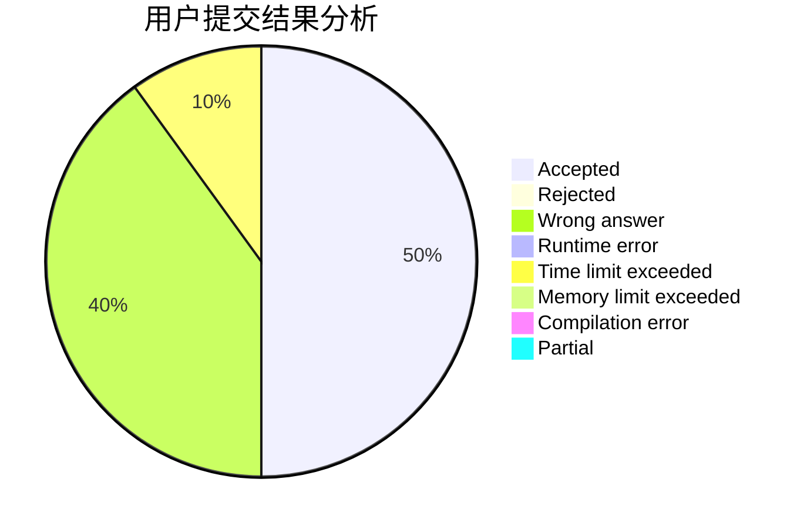
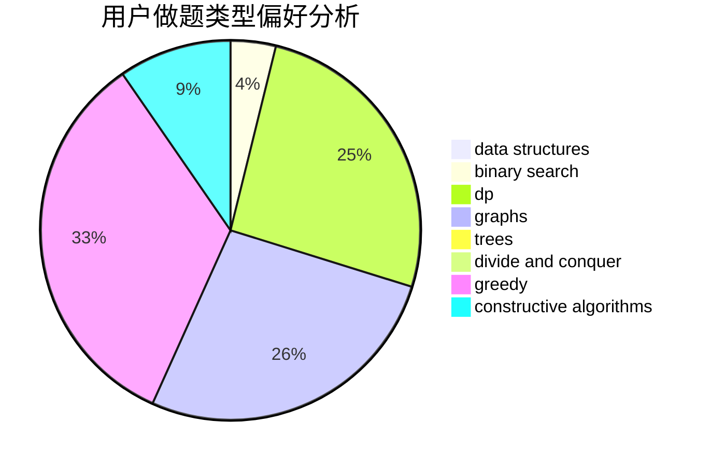
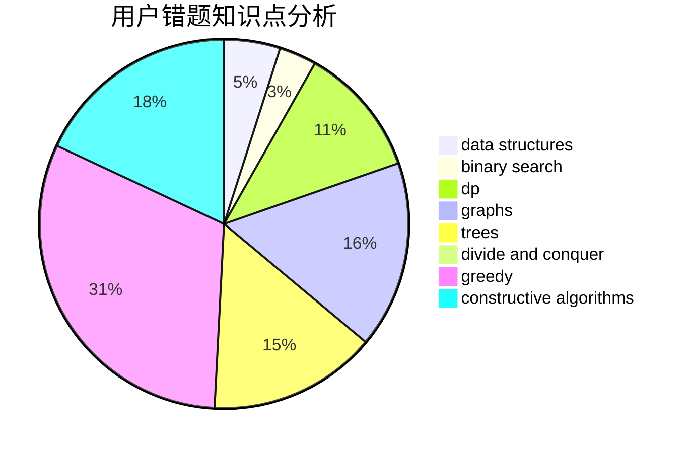

# lqx123123

<!-- tabs:start -->

#### **用户提交结果分析**

#### **用户做题类型偏好分析**

#### **用户错题知识点分析**

<!-- tabs:end -->
# 推荐题目
[1372B](https://codeforces.com/contest/1372/problem/B)		greedy,
                        math,
                        number theory		  
[445C](https://codeforces.com/contest/445/problem/C)		dsu,graphs,sortings,trees		  
[1340E](https://codeforces.com/contest/1340/problem/E)		graphs,
                        interactive,
                        probabilities		  
[1506F](https://codeforces.com/contest/1506/problem/F)		constructive algorithms,
                        graphs,
                        math,
                        shortest paths,
                        sortings		  
[353E](https://codeforces.com/contest/353/problem/E)		dp,
                        graph matchings,
                        greedy		  
[1164G](https://codeforces.com/contest/1164/problem/G)		dsu,graphs,sortings,trees		  
[1202B](https://codeforces.com/contest/1202/problem/B)		brute force,
                        dp,
                        shortest paths		  
[797C](https://codeforces.com/contest/797/problem/C)		data structures,
                        greedy,
                        strings		  
[1256F](https://codeforces.com/contest/1256/problem/F)		constructive algorithms,
                        sortings,
                        strings		  
[1116B1](https://codeforces.com/contest/1116B/problem/1)		nan		  
