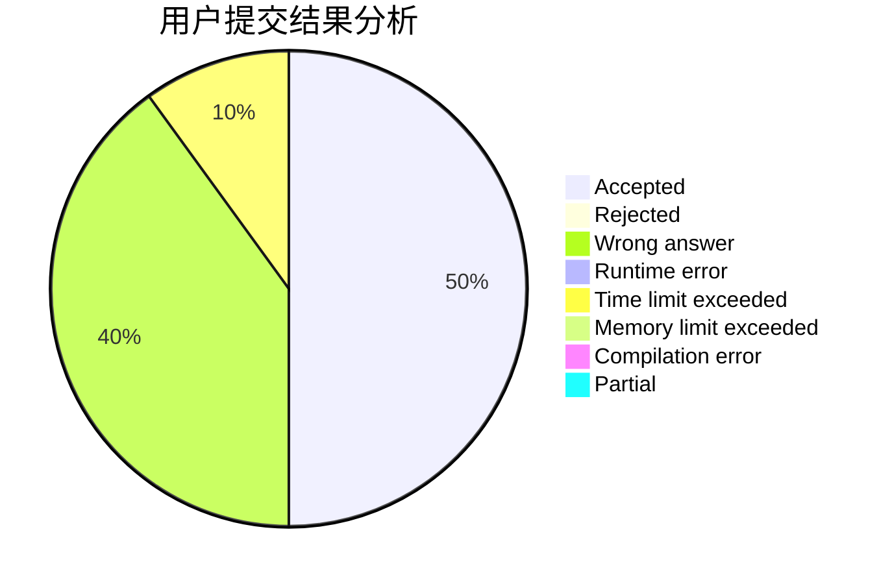
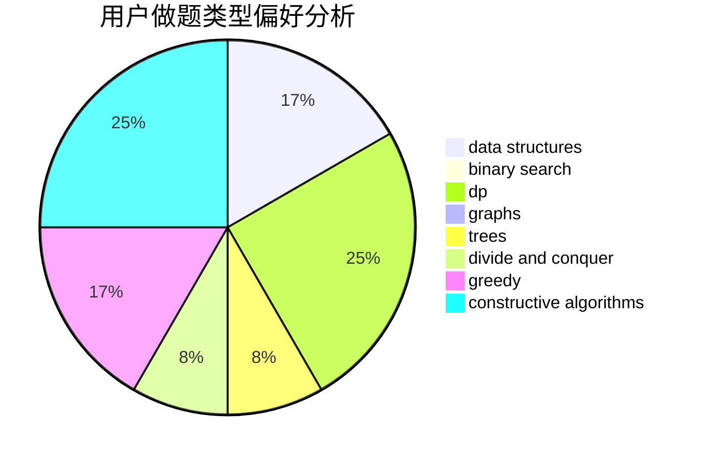
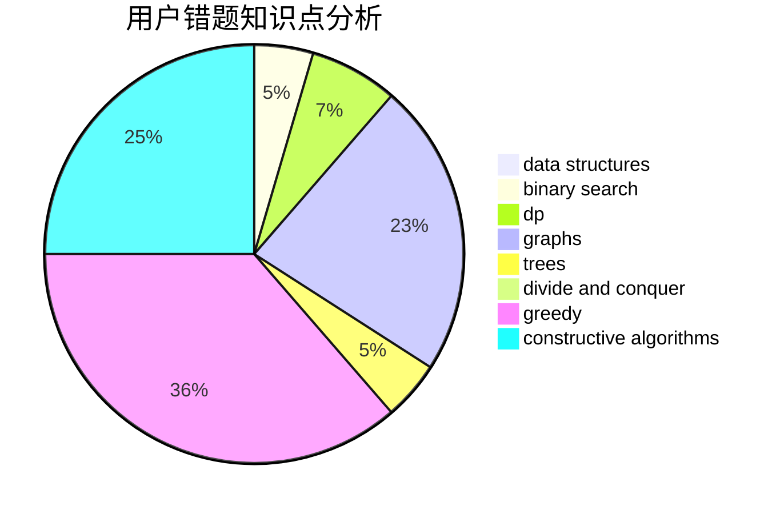

# lqx123123

<!-- tabs:start -->

#### **用户提交结果分析**

#### **用户做题类型偏好分析**

#### **用户错题知识点分析**

<!-- tabs:end -->
# 推荐题目
[1380G](https://codeforces.com/contest/1380/problem/G)		greedy,
                        math,
                        probabilities		  
[466A](https://codeforces.com/contest/466/problem/A)		implementation		  
[1347D](https://codeforces.com/contest/1347/problem/D)		dsu,graphs,sortings,trees		  
[158C](https://codeforces.com/contest/158/problem/C)		*special problem,
                        data structures,
                        implementation		  
[37B](https://codeforces.com/contest/37/problem/B)		greedy,
                        implementation		  
[1165D](https://codeforces.com/contest/1165/problem/D)		math,
                        number theory		  
[1206D](https://codeforces.com/contest/1206/problem/D)		dsu,graphs,sortings,trees		  
[811B](https://codeforces.com/contest/811/problem/B)		implementation,
                        sortings		  
[12642](https://codeforces.com/contest/1264/problem/2)		dsu,graphs,sortings,trees		  
[1117F](https://codeforces.com/contest/1117/problem/F)		bitmasks,
                        dp		  
