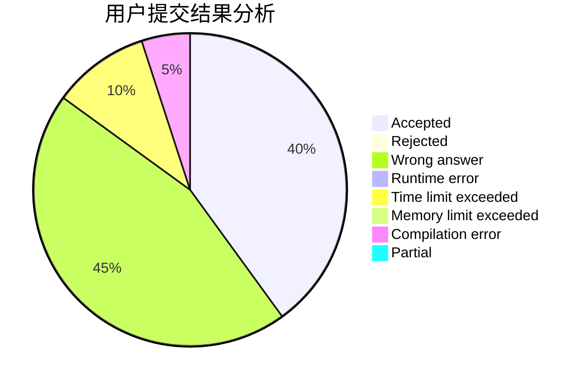
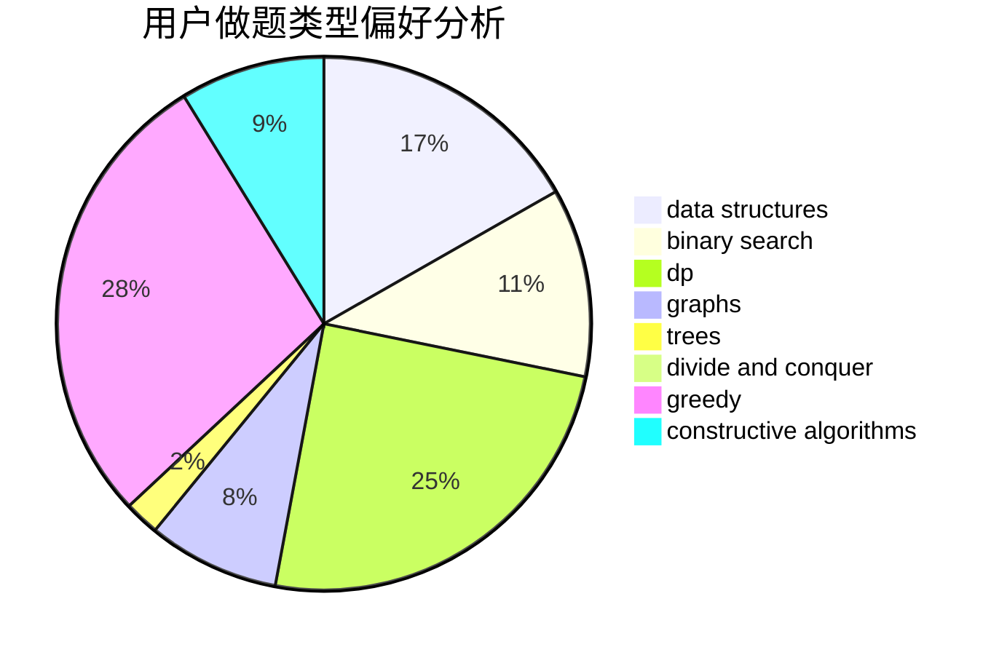
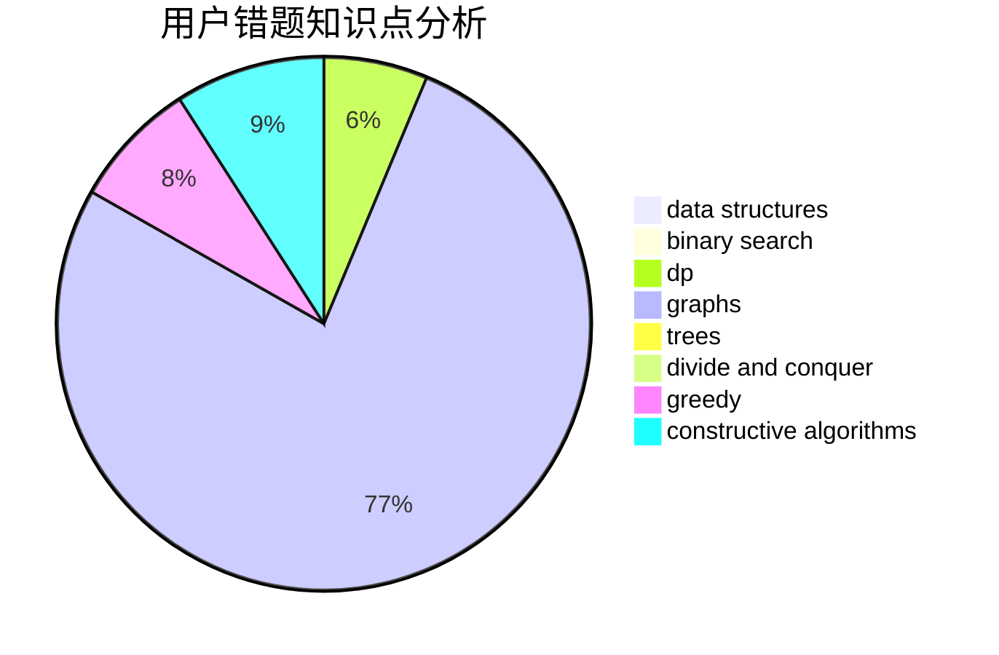

# lsbdebaba

<!-- tabs:start -->

#### **用户提交结果分析**

#### **用户做题类型偏好分析**

#### **用户错题知识点分析**

<!-- tabs:end -->
# 推荐题目
[182D](https://codeforces.com/contest/182/problem/D)		brute force,
                        hashing,
                        implementation,
                        math,
                        strings		  
[840D](https://codeforces.com/contest/840/problem/D)		data structures,
                        probabilities		  
[1339C](https://codeforces.com/contest/1339/problem/C)		dsu,graphs,sortings,trees		  
[913B](https://codeforces.com/contest/913/problem/B)		implementation,
                        trees		  
[913G](https://codeforces.com/contest/913/problem/G)		math,
                        number theory		  
[585F](https://codeforces.com/contest/585/problem/F)		dp,
                        implementation,
                        strings		  
[922B](https://codeforces.com/contest/922/problem/B)		brute force		  
[620B](https://codeforces.com/contest/620/problem/B)		implementation		  
[424A](https://codeforces.com/contest/424/problem/A)		implementation		  
[898B](https://codeforces.com/contest/898/problem/B)		brute force,
                        implementation,
                        number theory		  
