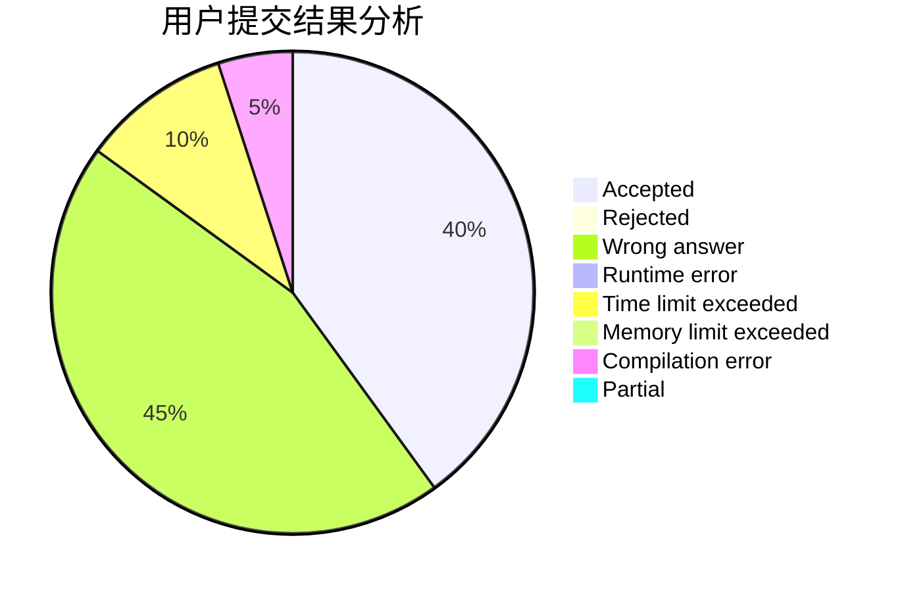
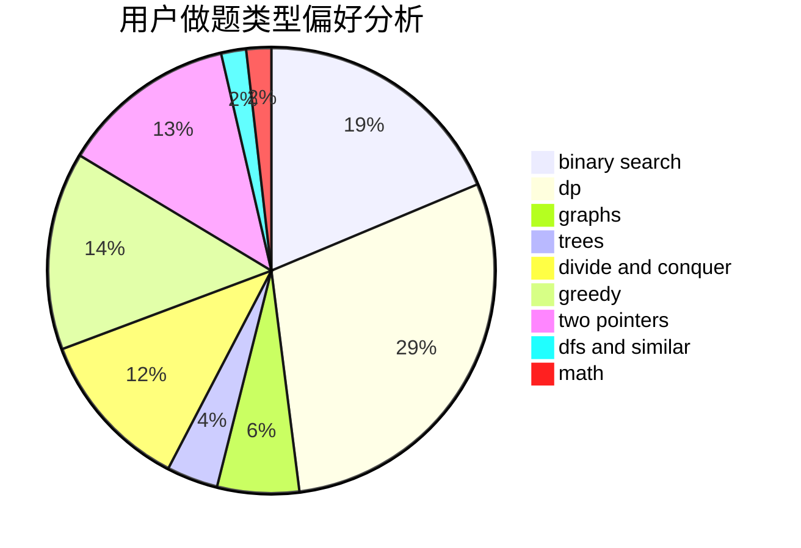

# lsbdebaba

<!-- tabs:start -->

#### **用户提交结果分析**

#### **用户做题类型偏好分析**

<!-- tabs:end -->
# 推荐题目
[182D](https://codeforces.com/contest/182/problem/D)
[840D](https://codeforces.com/contest/840/problem/D)
[1339C](https://codeforces.com/contest/1339/problem/C)
[913B](https://codeforces.com/contest/913/problem/B)
[913G](https://codeforces.com/contest/913/problem/G)
[585F](https://codeforces.com/contest/585/problem/F)
[922B](https://codeforces.com/contest/922/problem/B)
[620B](https://codeforces.com/contest/620/problem/B)
[424A](https://codeforces.com/contest/424/problem/A)
[898B](https://codeforces.com/contest/898/problem/B)
