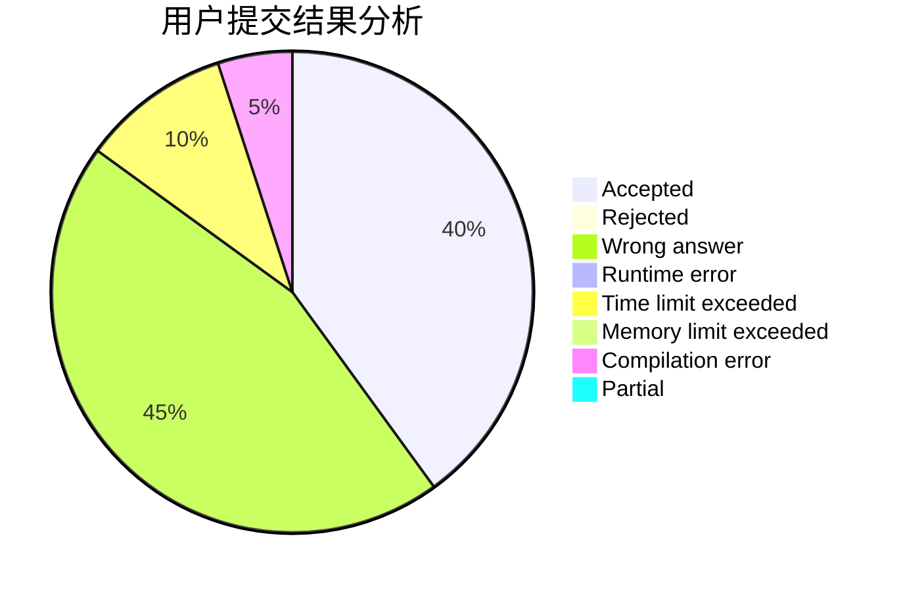
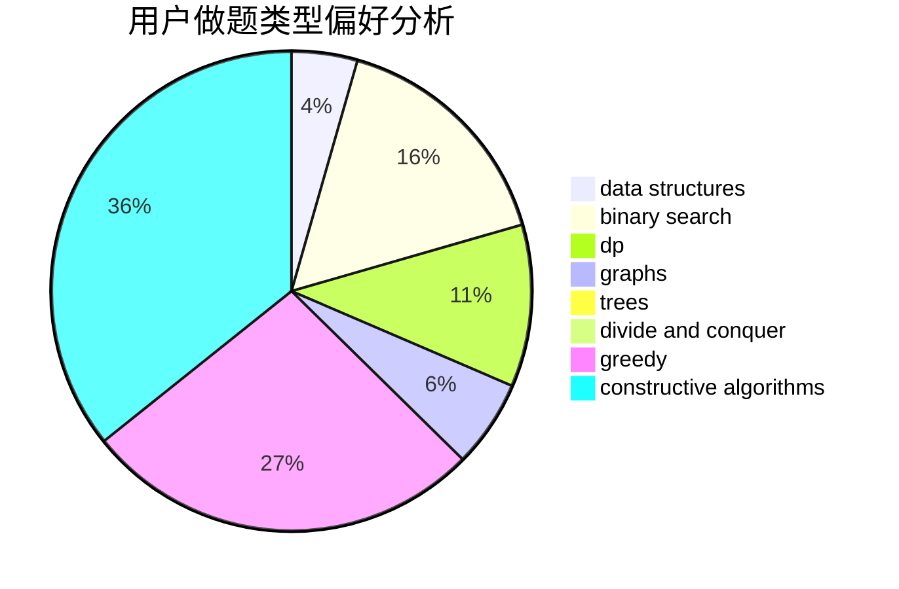
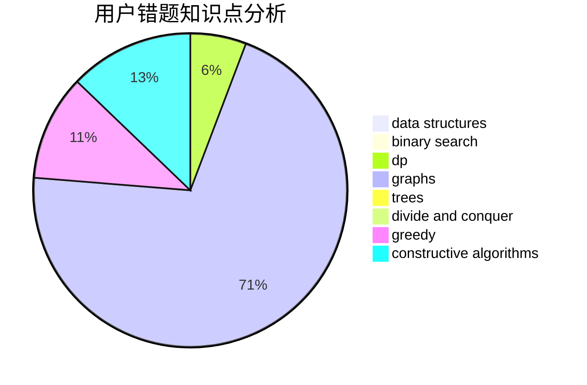

# lsbdebaba

<!-- tabs:start -->

#### **用户提交结果分析**

#### **用户做题类型偏好分析**

#### **用户错题知识点分析**

<!-- tabs:end -->
# 推荐题目
[15C](https://codeforces.com/contest/15/problem/C)		games		  
[820D](https://codeforces.com/contest/820/problem/D)		dsu,graphs,sortings,trees		  
[1332F](https://codeforces.com/contest/1332/problem/F)		dfs and similar,
                        dp,
                        trees		  
[895D](https://codeforces.com/contest/895/problem/D)		combinatorics,
                        math,
                        strings		  
[896D](https://codeforces.com/contest/896/problem/D)		chinese remainder theorem,
                        combinatorics,
                        math,
                        number theory		  
[567A](https://codeforces.com/contest/567/problem/A)		greedy,
                        implementation		  
[908A](https://codeforces.com/contest/908/problem/A)		brute force,
                        implementation		  
[600F](https://codeforces.com/contest/600/problem/F)		graphs		  
[394C](https://codeforces.com/contest/394/problem/C)		constructive algorithms,
                        greedy		  
[877C](https://codeforces.com/contest/877/problem/C)		constructive algorithms		  
