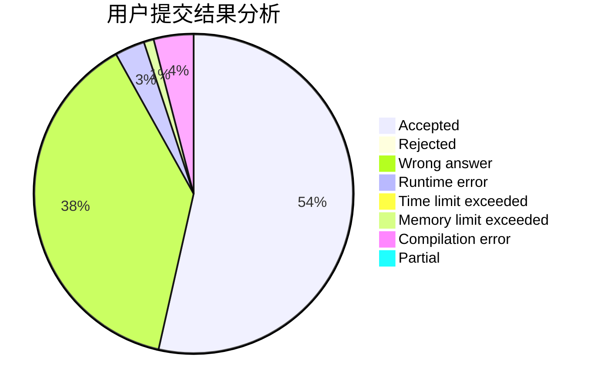
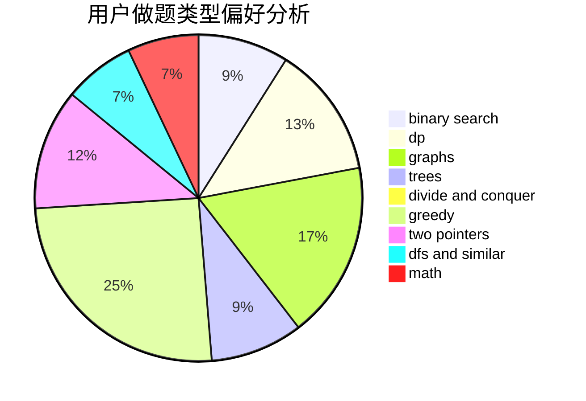

# lsl

<!-- tabs:start -->

#### **用户提交结果分析**

#### **用户做题类型偏好分析**

<!-- tabs:end -->
# 推荐题目
[396C](https://codeforces.com/contest/396/problem/C)
[1408E](https://codeforces.com/contest/1408/problem/E)
[338D](https://codeforces.com/contest/338/problem/D)
[19A](https://codeforces.com/contest/19/problem/A)
[238E](https://codeforces.com/contest/238/problem/E)
[294B](https://codeforces.com/contest/294/problem/B)
[989A](https://codeforces.com/contest/989/problem/A)
[1131F](https://codeforces.com/contest/1131/problem/F)
[494A](https://codeforces.com/contest/494/problem/A)
[218C](https://codeforces.com/contest/218/problem/C)
