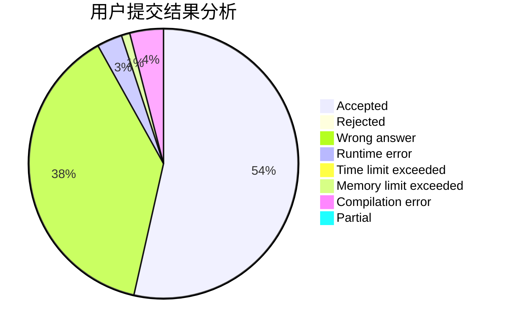
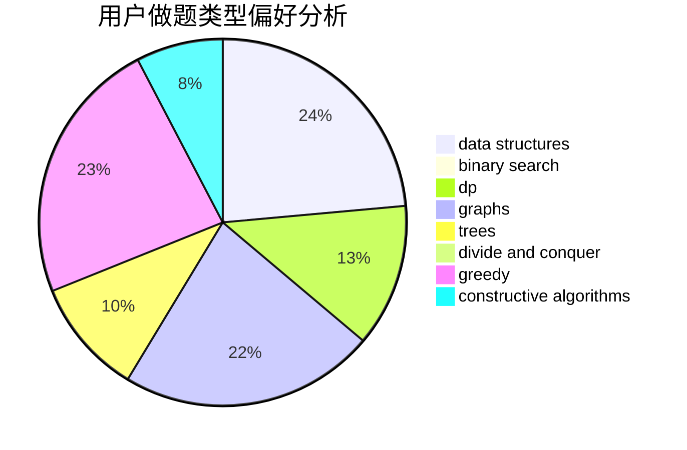
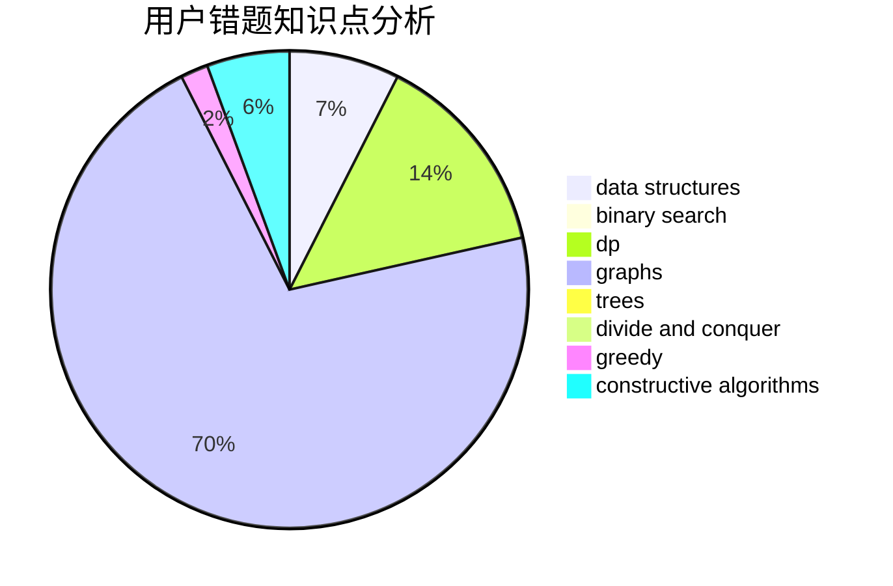

# lsl

<!-- tabs:start -->

#### **用户提交结果分析**

#### **用户做题类型偏好分析**

#### **用户错题知识点分析**

<!-- tabs:end -->
# 推荐题目
[396C](https://codeforces.com/contest/396/problem/C)		data structures,
                        graphs,
                        trees		  
[1408E](https://codeforces.com/contest/1408/problem/E)		data structures,
                        dsu,
                        graphs,
                        greedy,
                        sortings,
                        trees		  
[338D](https://codeforces.com/contest/338/problem/D)		chinese remainder theorem,
                        math,
                        number theory		  
[19A](https://codeforces.com/contest/19/problem/A)		implementation		  
[238E](https://codeforces.com/contest/238/problem/E)		dp,
                        graphs,
                        shortest paths		  
[294B](https://codeforces.com/contest/294/problem/B)		dp,
                        greedy		  
[989A](https://codeforces.com/contest/989/problem/A)		implementation,
                        strings		  
[1131F](https://codeforces.com/contest/1131/problem/F)		constructive algorithms,
                        dsu		  
[494A](https://codeforces.com/contest/494/problem/A)		greedy		  
[218C](https://codeforces.com/contest/218/problem/C)		dsu,graphs,sortings,trees		  
