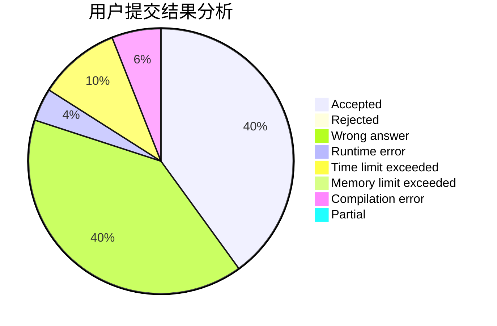
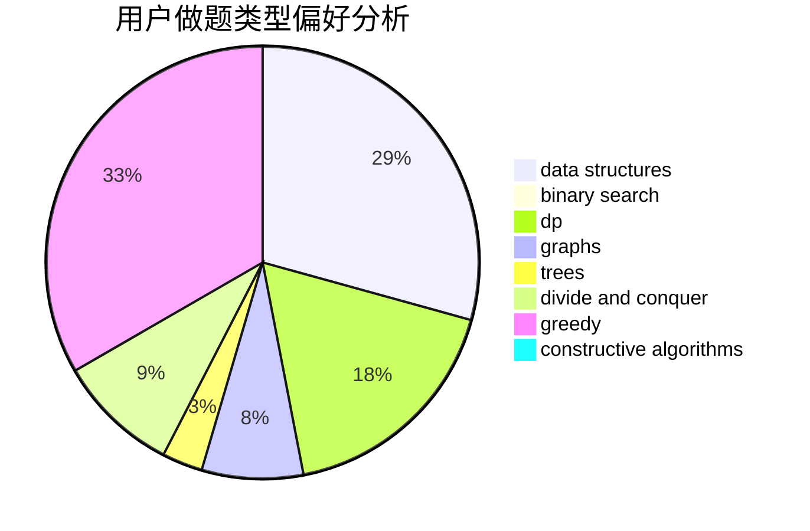
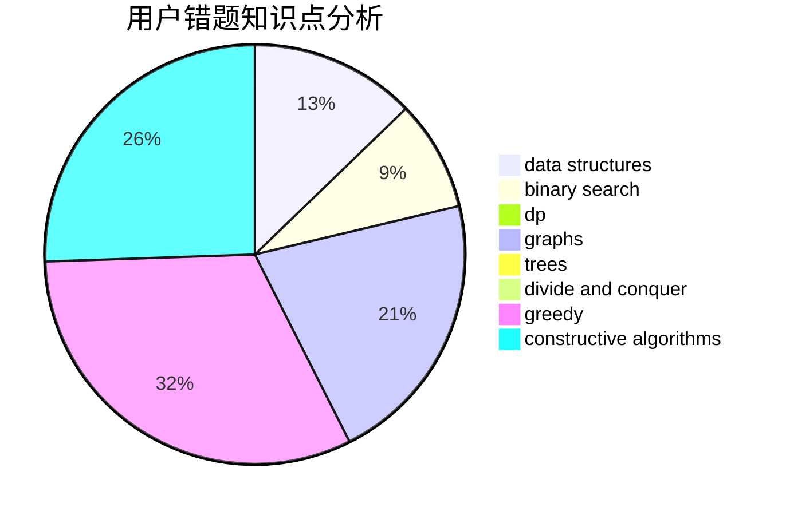

# BingHui

<!-- tabs:start -->

#### **用户提交结果分析**

#### **用户做题类型偏好分析**

#### **用户错题知识点分析**

<!-- tabs:end -->
# 推荐题目
[1426D](https://codeforces.com/contest/1426/problem/D)		constructive algorithms,
                        data structures,
                        greedy,
                        sortings		  
[1220B](https://codeforces.com/contest/1220/problem/B)		math,
                        number theory		  
[544D](https://codeforces.com/contest/544/problem/D)		dsu,graphs,sortings,trees		  
[545A](https://codeforces.com/contest/545/problem/A)		implementation		  
[102B](https://codeforces.com/contest/102/problem/B)		implementation		  
[1013B](https://codeforces.com/contest/1013/problem/B)		greedy		  
[514D](https://codeforces.com/contest/514/problem/D)		binary search,
                        data structures,
                        two pointers		  
[1118B](https://codeforces.com/contest/1118/problem/B)		implementation		  
[1032E](https://codeforces.com/contest/1032/problem/E)		dp,
                        math		  
[218A](https://codeforces.com/contest/218/problem/A)		brute force,
                        constructive algorithms,
                        implementation		  
