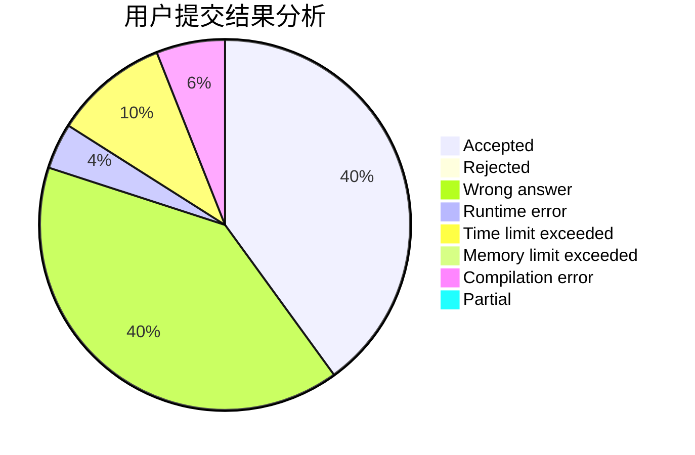
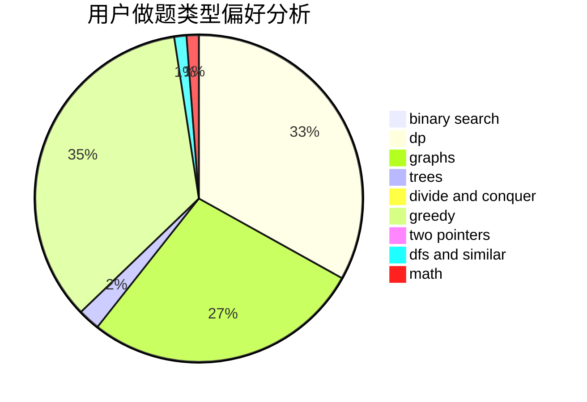

# BingHui

<!-- tabs:start -->

#### **用户提交结果分析**

#### **用户做题类型偏好分析**

<!-- tabs:end -->
# 推荐题目
[1435A](https://codeforces.com/contest/1435/problem/A)
[1228B](https://codeforces.com/contest/1228/problem/B)
[569A](https://codeforces.com/contest/569/problem/A)
[56A](https://codeforces.com/contest/56/problem/A)
[1030C](https://codeforces.com/contest/1030/problem/C)
[1013E](https://codeforces.com/contest/1013/problem/E)
[540B](https://codeforces.com/contest/540/problem/B)
[1119G](https://codeforces.com/contest/1119/problem/G)
[1033B](https://codeforces.com/contest/1033/problem/B)
[236D](https://codeforces.com/contest/236/problem/D)
