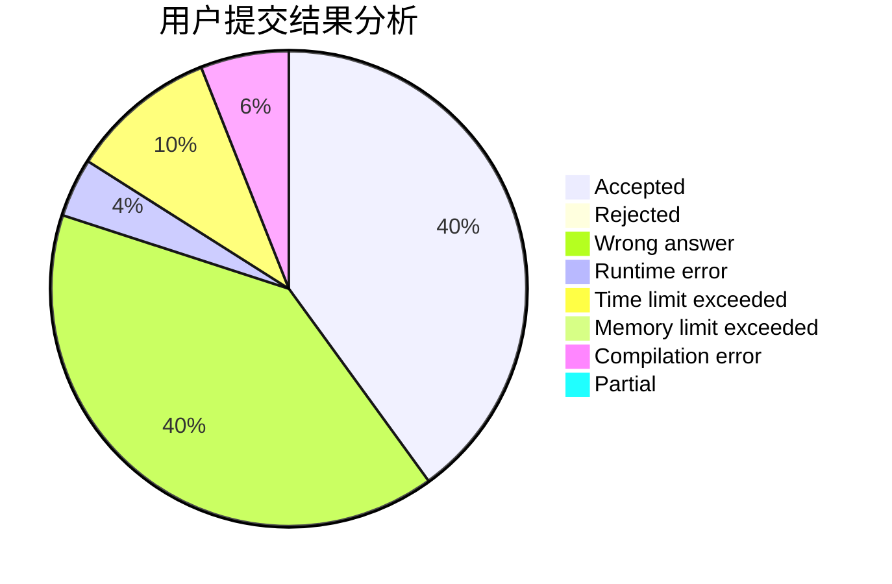
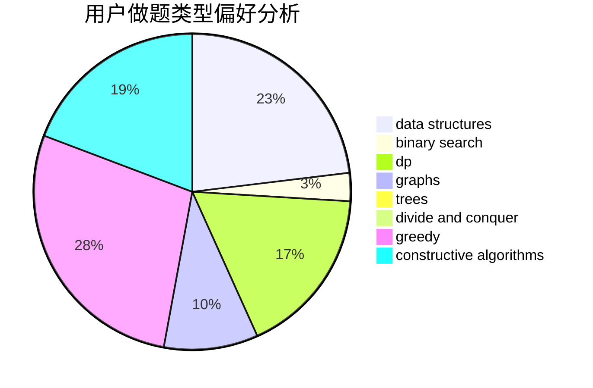

# BingHui

<!-- tabs:start -->

#### **用户提交结果分析**

#### **用户做题类型偏好分析**

#### **用户错题知识点分析**

<!-- tabs:end -->
# 推荐题目
[1435A](https://codeforces.com/contest/1435/problem/A)		dsu,graphs,sortings,trees		  
[1228B](https://codeforces.com/contest/1228/problem/B)		implementation,
                        math		  
[569A](https://codeforces.com/contest/569/problem/A)		implementation,
                        math		  
[56A](https://codeforces.com/contest/56/problem/A)		implementation		  
[1030C](https://codeforces.com/contest/1030/problem/C)		implementation		  
[1013E](https://codeforces.com/contest/1013/problem/E)		dsu,graphs,sortings,trees		  
[540B](https://codeforces.com/contest/540/problem/B)		greedy,
                        implementation		  
[1119G](https://codeforces.com/contest/1119/problem/G)		constructive algorithms,
                        implementation		  
[1033B](https://codeforces.com/contest/1033/problem/B)		math,
                        number theory		  
[236D](https://codeforces.com/contest/236/problem/D)		dsu,graphs,sortings,trees		  
