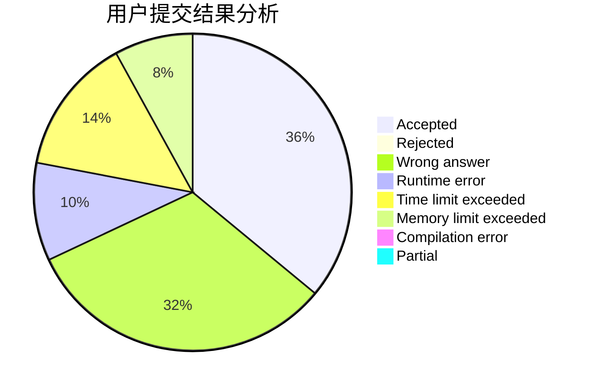
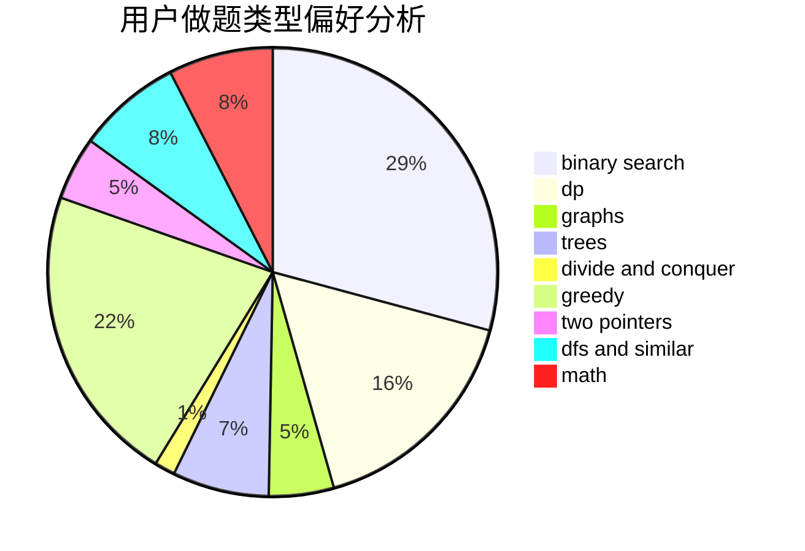

# lt123456

<!-- tabs:start -->

#### **用户提交结果分析**

#### **用户做题类型偏好分析**

<!-- tabs:end -->
# 推荐题目
[1093B](https://codeforces.com/contest/1093/problem/B)
[603E](https://codeforces.com/contest/603/problem/E)
[835C](https://codeforces.com/contest/835/problem/C)
[14472](https://codeforces.com/contest/1447/problem/2)
[560E](https://codeforces.com/contest/560/problem/E)
[876A](https://codeforces.com/contest/876/problem/A)
[652E](https://codeforces.com/contest/652/problem/E)
[471D](https://codeforces.com/contest/471/problem/D)
[725F](https://codeforces.com/contest/725/problem/F)
[819B](https://codeforces.com/contest/819/problem/B)
