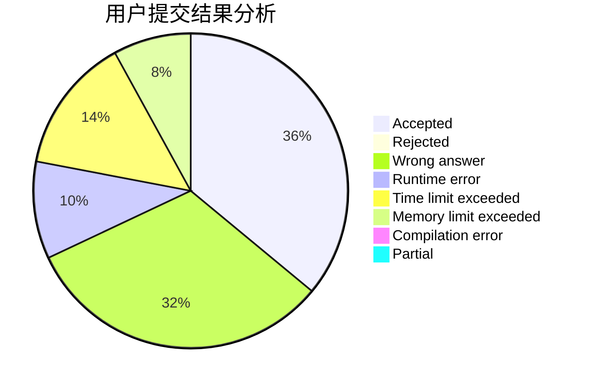
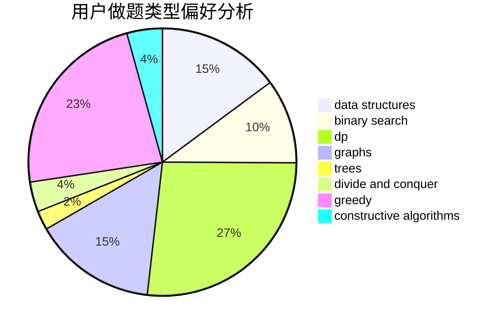
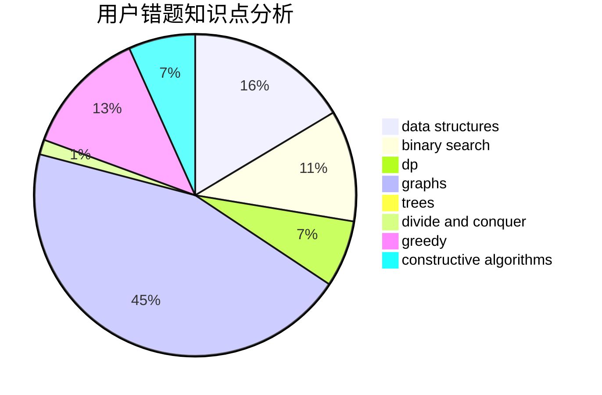

# lt123456
<!-- tabs:start -->
#### **用户提交结果分析**

#### **用户做题类型偏好分析**

#### **用户错题知识点分析**

<!-- tabs:end -->
# 推荐题目
[Minimal Diameter Forest](http://codeforces.com/problemset/problem/1092/E)		constructive algorithms,
                        dfs and similar,
                        greedy,
                        trees		  
[Karen and Coffee](http://codeforces.com/problemset/problem/816/B)		binary search,
                        data structures,
                        implementation		  
[Colorful Stones](http://codeforces.com/problemset/problem/264/D)		dp,
                        two pointers		  
[Number of Binominal Coefficients](http://codeforces.com/problemset/problem/582/D)		dp,
                        math,
                        number theory		  
[Dead Ends](http://codeforces.com/problemset/problem/53/E)		bitmasks,
                        dp		  
[Anfisa the Monkey](http://codeforces.com/problemset/problem/44/E)		dp		  
[k-rounding](http://codeforces.com/problemset/problem/858/A)		brute force,
                        math,
                        number theory		  
[Almost Acyclic Graph](http://codeforces.com/problemset/problem/915/D)		dfs and similar,
                        graphs		  
[DNA Alignment](http://codeforces.com/problemset/problem/520/C)		math,
                        strings		  
[Days of Floral Colours](http://codeforces.com/problemset/problem/848/E)		combinatorics,
                        divide and conquer,
                        dp,
                        fft,
                        math		  
<!-- tabs:start -->
#### **data structures**
[Minimal Diameter Forest](http://codeforces.com/problemset/problem/816/B)		binary search,
                        data structures,
                        implementation		  
[Karen and Coffee](http://codeforces.com/problemset/problem/429/D)		data structures,
                        divide and conquer,
                        geometry		  
[Colorful Stones](http://codeforces.com/problemset/problem/1037/H)		data structures,
                        string suffix structures		  
[Number of Binominal Coefficients](http://codeforces.com/problemset/problem/418/D)		data structures,
                        graphs,
                        trees		  
[Dead Ends](http://codeforces.com/problemset/problem/707/D)		bitmasks,
                        data structures,
                        dfs and similar,
                        implementation		  
[Anfisa the Monkey](https://codeforces.com/contest/1314/problem/E)		binary search,
                        data structures,
                        dp,
                        greedy		  
[k-rounding](http://codeforces.com/problemset/problem/1428/F)		binary search,
                        data structures,
                        divide and conquer,
                        dp,
                        two pointers		  
[Almost Acyclic Graph](http://codeforces.com/problemset/problem/1492/C)		binary search,
                        data structures,
                        dp,
                        greedy,
                        two pointers		  
[DNA Alignment](http://codeforces.com/problemset/problem/1490/G)		binary search,
                        data structures,
                        math		  
[Days of Floral Colours](http://codeforces.com/problemset/problem/1479/D)		binary search,
                        bitmasks,
                        brute force,
                        data structures,
                        probabilities,
                        trees		  
#### **binary search**
[Minimal Diameter Forest](http://codeforces.com/problemset/problem/816/B)		binary search,
                        data structures,
                        implementation		  
[Karen and Coffee](http://codeforces.com/problemset/problem/803/D)		binary search,
                        greedy		  
[Colorful Stones](http://codeforces.com/problemset/problem/555/D)		binary search,
                        implementation,
                        math		  
[Number of Binominal Coefficients](http://codeforces.com/problemset/problem/487/A)		binary search,
                        brute force,
                        implementation		  
[Dead Ends](https://codeforces.com/contest/1314/problem/E)		binary search,
                        data structures,
                        dp,
                        greedy		  
[Anfisa the Monkey](http://codeforces.com/problemset/problem/1428/F)		binary search,
                        data structures,
                        divide and conquer,
                        dp,
                        two pointers		  
[k-rounding](http://codeforces.com/problemset/problem/1492/C)		binary search,
                        data structures,
                        dp,
                        greedy,
                        two pointers		  
[Almost Acyclic Graph](http://codeforces.com/problemset/problem/1463/D)		binary search,
                        constructive algorithms,
                        greedy,
                        two pointers		  
[DNA Alignment](http://codeforces.com/problemset/problem/1490/G)		binary search,
                        data structures,
                        math		  
[Days of Floral Colours](http://codeforces.com/problemset/problem/1479/D)		binary search,
                        bitmasks,
                        brute force,
                        data structures,
                        probabilities,
                        trees		  
#### **dp**
[Minimal Diameter Forest](http://codeforces.com/problemset/problem/264/D)		dp,
                        two pointers		  
[Karen and Coffee](http://codeforces.com/problemset/problem/582/D)		dp,
                        math,
                        number theory		  
[Colorful Stones](http://codeforces.com/problemset/problem/53/E)		bitmasks,
                        dp		  
[Number of Binominal Coefficients](http://codeforces.com/problemset/problem/44/E)		dp		  
[Dead Ends](http://codeforces.com/problemset/problem/848/E)		combinatorics,
                        divide and conquer,
                        dp,
                        fft,
                        math		  
[Anfisa the Monkey](http://codeforces.com/problemset/problem/1408/G)		combinatorics,
                        dp,
                        dsu,
                        fft,
                        graphs,
                        trees		  
[k-rounding](http://codeforces.com/problemset/problem/626/D)		brute force,
                        combinatorics,
                        dp,
                        probabilities		  
[Almost Acyclic Graph](http://codeforces.com/problemset/problem/724/E)		dp,
                        flows,
                        greedy		  
[DNA Alignment](http://codeforces.com/problemset/problem/1437/C)		dp,
                        flows,
                        graph matchings,
                        greedy,
                        math,
                        sortings		  
[Days of Floral Colours](https://codeforces.com/contest/1314/problem/E)		binary search,
                        data structures,
                        dp,
                        greedy		  
#### **graph**
[Minimal Diameter Forest](http://codeforces.com/problemset/problem/915/D)		dfs and similar,
                        graphs		  
[Karen and Coffee](http://codeforces.com/problemset/problem/1408/G)		combinatorics,
                        dp,
                        dsu,
                        fft,
                        graphs,
                        trees		  
[Colorful Stones](http://codeforces.com/problemset/problem/1033/A)		dfs and similar,
                        graphs,
                        implementation		  
[Number of Binominal Coefficients](http://codeforces.com/problemset/problem/418/D)		data structures,
                        graphs,
                        trees		  
[Dead Ends](http://codeforces.com/problemset/problem/1437/C)		dp,
                        flows,
                        graph matchings,
                        greedy,
                        math,
                        sortings		  
[Anfisa the Monkey](http://codeforces.com/problemset/problem/1394/B)		brute force,
                        dfs and similar,
                        graphs,
                        hashing		  
[k-rounding](http://codeforces.com/problemset/problem/1487/C)		brute force,
                        constructive algorithms,
                        dfs and similar,
                        graphs,
                        greedy,
                        implementation,
                        math		  
[Almost Acyclic Graph](http://codeforces.com/problemset/problem/1437/C)		dp,
                        flows,
                        graph matchings,
                        greedy,
                        math,
                        sortings		  
[DNA Alignment](http://codeforces.com/problemset/problem/1470/D)		constructive algorithms,
                        dfs and similar,
                        graph matchings,
                        graphs,
                        greedy		  
[Days of Floral Colours](http://codeforces.com/problemset/problem/1476/C)		dp,
                        graphs,
                        greedy		  
#### **trees**
[Minimal Diameter Forest](http://codeforces.com/problemset/problem/1092/E)		constructive algorithms,
                        dfs and similar,
                        greedy,
                        trees		  
[Karen and Coffee](http://codeforces.com/problemset/problem/1408/G)		combinatorics,
                        dp,
                        dsu,
                        fft,
                        graphs,
                        trees		  
[Colorful Stones](http://codeforces.com/problemset/problem/418/D)		data structures,
                        graphs,
                        trees		  
[Number of Binominal Coefficients](http://codeforces.com/problemset/problem/1363/E)		dfs and similar,
                        dp,
                        greedy,
                        trees		  
[Dead Ends](http://codeforces.com/problemset/problem/1479/D)		binary search,
                        bitmasks,
                        brute force,
                        data structures,
                        probabilities,
                        trees		  
[Anfisa the Monkey](http://codeforces.com/problemset/problem/1511/C)		brute force,
                        data structures,
                        implementation,
                        trees		  
[k-rounding](http://codeforces.com/problemset/problem/1499/F)		combinatorics,
                        dfs and similar,
                        dp,
                        trees		  
[Almost Acyclic Graph](http://codeforces.com/problemset/problem/1491/E)		brute force,
                        dfs and similar,
                        divide and conquer,
                        number theory,
                        trees		  
[DNA Alignment](http://codeforces.com/problemset/problem/1466/D)		data structures,
                        greedy,
                        sortings,
                        trees		  
[Days of Floral Colours](http://codeforces.com/problemset/problem/1495/D)		combinatorics,
                        dfs and similar,
                        graphs,
                        math,
                        shortest paths,
                        trees		  
#### **divide and conquer**
[Minimal Diameter Forest](http://codeforces.com/problemset/problem/848/E)		combinatorics,
                        divide and conquer,
                        dp,
                        fft,
                        math		  
[Karen and Coffee](http://codeforces.com/problemset/problem/429/D)		data structures,
                        divide and conquer,
                        geometry		  
[Colorful Stones](http://codeforces.com/problemset/problem/1428/F)		binary search,
                        data structures,
                        divide and conquer,
                        dp,
                        two pointers		  
[Number of Binominal Coefficients](http://codeforces.com/problemset/problem/1461/D)		binary search,
                        brute force,
                        data structures,
                        divide and conquer,
                        implementation,
                        sortings		  
[Dead Ends](http://codeforces.com/problemset/problem/1466/G)		combinatorics,
                        divide and conquer,
                        hashing,
                        math,
                        string suffix structures,
                        strings		  
[Anfisa the Monkey](http://codeforces.com/problemset/problem/1490/D)		dfs and similar,
                        divide and conquer,
                        implementation		  
[k-rounding](https://codeforces.com/contest/1483/problem/C)		data structures,
                        divide and conquer,
                        dp		  
[Almost Acyclic Graph](http://codeforces.com/problemset/problem/1491/E)		brute force,
                        dfs and similar,
                        divide and conquer,
                        number theory,
                        trees		  
[DNA Alignment](http://codeforces.com/problemset/problem/1303/G)		data structures,
                        divide and conquer,
                        geometry,
                        trees		  
[Days of Floral Colours](http://codeforces.com/problemset/problem/1494/D)		constructive algorithms,
                        data structures,
                        dfs and similar,
                        divide and conquer,
                        dsu,
                        greedy,
                        sortings,
                        trees		  
#### **greedy**
[Minimal Diameter Forest](http://codeforces.com/problemset/problem/1092/E)		constructive algorithms,
                        dfs and similar,
                        greedy,
                        trees		  
[Karen and Coffee](http://codeforces.com/problemset/problem/803/D)		binary search,
                        greedy		  
[Colorful Stones](http://codeforces.com/problemset/problem/496/E)		greedy,
                        sortings		  
[Number of Binominal Coefficients](http://codeforces.com/problemset/problem/1084/B)		greedy,
                        implementation		  
[Dead Ends](http://codeforces.com/problemset/problem/724/E)		dp,
                        flows,
                        greedy		  
[Anfisa the Monkey](http://codeforces.com/problemset/problem/518/B)		greedy,
                        implementation,
                        strings		  
[k-rounding](http://codeforces.com/problemset/problem/1437/C)		dp,
                        flows,
                        graph matchings,
                        greedy,
                        math,
                        sortings		  
[Almost Acyclic Graph](http://codeforces.com/problemset/problem/1270/B)		constructive algorithms,
                        greedy,
                        math		  
[DNA Alignment](http://codeforces.com/problemset/problem/381/A)		greedy,
                        implementation,
                        two pointers		  
[Days of Floral Colours](https://codeforces.com/contest/1314/problem/E)		binary search,
                        data structures,
                        dp,
                        greedy		  
#### **constructive algorithms**
[Minimal Diameter Forest](http://codeforces.com/problemset/problem/1092/E)		constructive algorithms,
                        dfs and similar,
                        greedy,
                        trees		  
[Karen and Coffee](http://codeforces.com/problemset/problem/1270/B)		constructive algorithms,
                        greedy,
                        math		  
[Colorful Stones](http://codeforces.com/problemset/problem/476/D)		constructive algorithms,
                        greedy,
                        math		  
[Number of Binominal Coefficients](http://codeforces.com/problemset/problem/1332/E)		combinatorics,
                        constructive algorithms,
                        math,
                        matrices		  
[Dead Ends](http://codeforces.com/problemset/problem/1421/D)		brute force,
                        constructive algorithms,
                        greedy,
                        implementation,
                        math,
                        shortest paths		  
[Anfisa the Monkey](http://codeforces.com/problemset/problem/1493/A)		constructive algorithms,
                        greedy		  
[k-rounding](http://codeforces.com/problemset/problem/1463/D)		binary search,
                        constructive algorithms,
                        greedy,
                        two pointers		  
[Almost Acyclic Graph](https://codeforces.com/contest/1456/problem/B)		bitmasks,
                        brute force,
                        constructive algorithms		  
[DNA Alignment](http://codeforces.com/problemset/problem/1492/D)		bitmasks,
                        constructive algorithms,
                        greedy,
                        math		  
[Days of Floral Colours](https://codeforces.com/contest/1504/problem/D)		constructive algorithms,
                        games,
                        interactive		  
#### **sortings**
[Minimal Diameter Forest](http://codeforces.com/problemset/problem/1206/A)		math,
                        sortings		  
[Karen and Coffee](http://codeforces.com/problemset/problem/496/E)		greedy,
                        sortings		  
[Colorful Stones](http://codeforces.com/problemset/problem/593/B)		geometry,
                        sortings		  
[Number of Binominal Coefficients](http://codeforces.com/problemset/problem/1437/C)		dp,
                        flows,
                        graph matchings,
                        greedy,
                        math,
                        sortings		  
[Dead Ends](http://codeforces.com/problemset/problem/490/A)		greedy,
                        implementation,
                        sortings		  
[Anfisa the Monkey](https://codeforces.com/contest/1496/problem/C)		geometry,
                        greedy,
                        math,
                        sortings		  
[k-rounding](http://codeforces.com/problemset/problem/1495/A)		geometry,
                        greedy,
                        math,
                        sortings		  
[Almost Acyclic Graph](http://codeforces.com/problemset/problem/1497/A)		brute force,
                        data structures,
                        greedy,
                        sortings		  
[DNA Alignment](http://codeforces.com/problemset/problem/1427/A)		math,
                        sortings		  
[Days of Floral Colours](http://codeforces.com/problemset/problem/1461/D)		binary search,
                        brute force,
                        data structures,
                        divide and conquer,
                        implementation,
                        sortings		  
<!-- tabs:end -->
