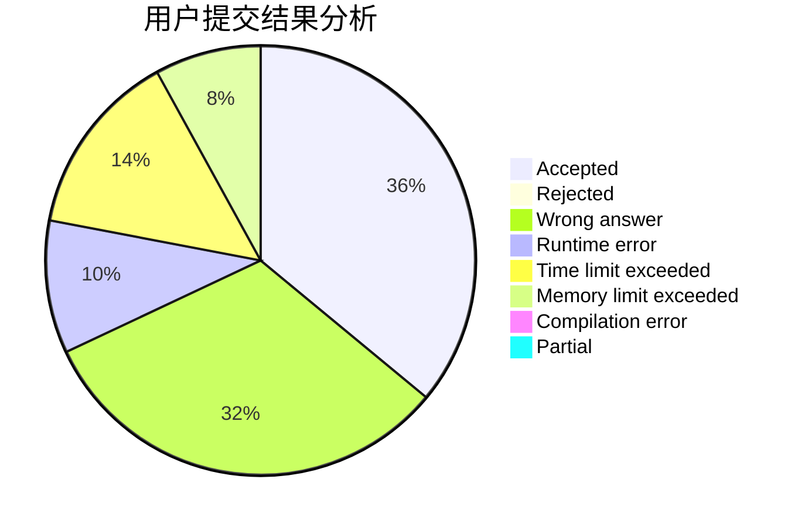
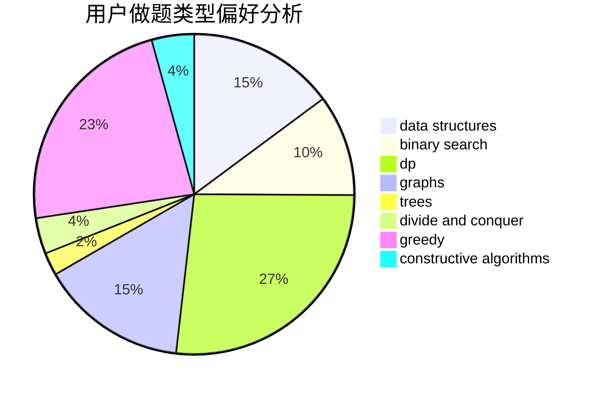
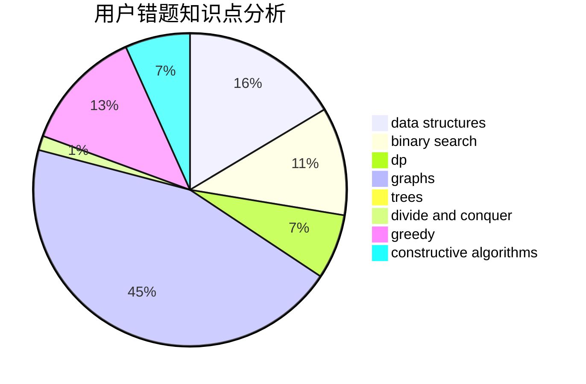

# lt123456

<!-- tabs:start -->

#### **用户提交结果分析**

#### **用户做题类型偏好分析**

#### **用户错题知识点分析**

<!-- tabs:end -->
# 推荐题目
[1092E](https://codeforces.com/contest/1092/problem/E)		constructive algorithms,
                        dfs and similar,
                        greedy,
                        trees		  
[582D](https://codeforces.com/contest/582/problem/D)		dp,
                        math,
                        number theory		  
[816B](https://codeforces.com/contest/816/problem/B)		binary search,
                        data structures,
                        implementation		  
[1437C](https://codeforces.com/contest/1437/problem/C)		dp,
                        flows,
                        graph matchings,
                        greedy,
                        math,
                        sortings		  
[53E](https://codeforces.com/contest/53/problem/E)		bitmasks,
                        dp		  
[858A](https://codeforces.com/contest/858/problem/A)		brute force,
                        math,
                        number theory		  
[626D](https://codeforces.com/contest/626/problem/D)		brute force,
                        combinatorics,
                        dp,
                        probabilities		  
[44E](https://codeforces.com/contest/44/problem/E)		dp		  
[707D](https://codeforces.com/contest/707/problem/D)		bitmasks,
                        data structures,
                        dfs and similar,
                        implementation		  
[803D](https://codeforces.com/contest/803/problem/D)		binary search,
                        greedy		  
