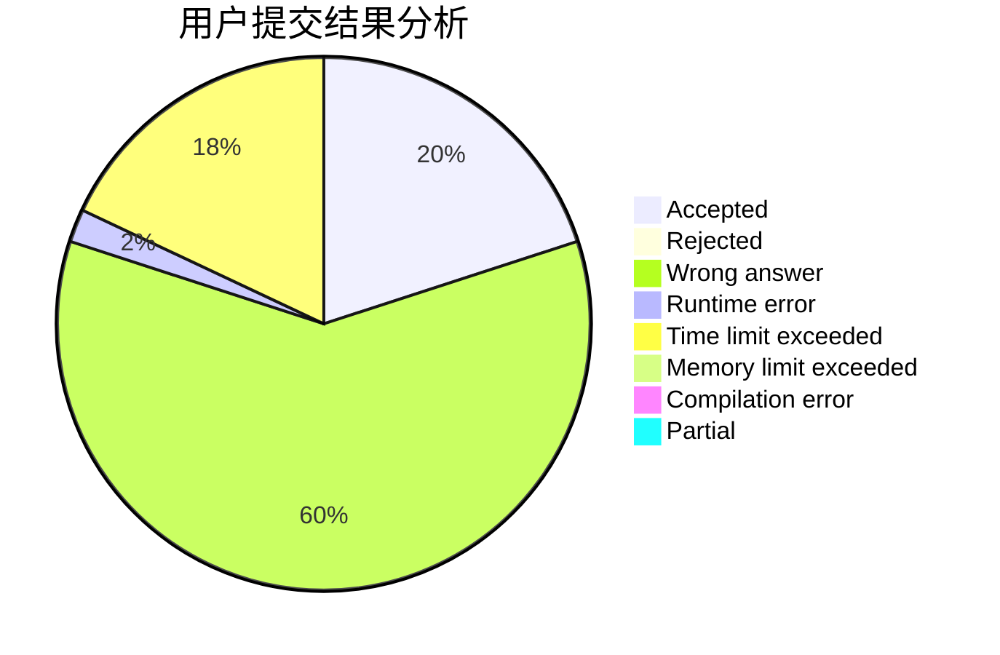
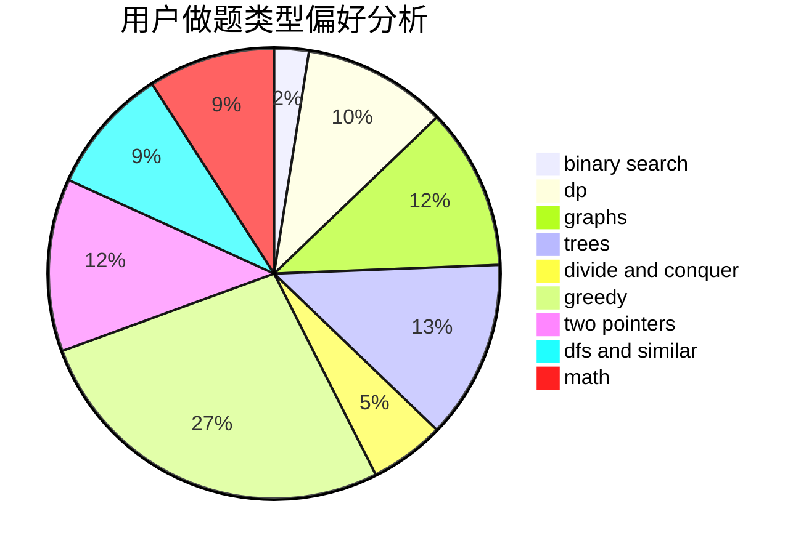

# lucccff

<!-- tabs:start -->

#### **用户提交结果分析**

#### **用户做题类型偏好分析**

<!-- tabs:end -->
# 推荐题目
[285E](https://codeforces.com/contest/285/problem/E)
[39C](https://codeforces.com/contest/39/problem/C)
[44E](https://codeforces.com/contest/44/problem/E)
[327A](https://codeforces.com/contest/327/problem/A)
[38C](https://codeforces.com/contest/38/problem/C)
[297B](https://codeforces.com/contest/297/problem/B)
[849A](https://codeforces.com/contest/849/problem/A)
[1039A](https://codeforces.com/contest/1039/problem/A)
[501A](https://codeforces.com/contest/501/problem/A)
[660A](https://codeforces.com/contest/660/problem/A)
