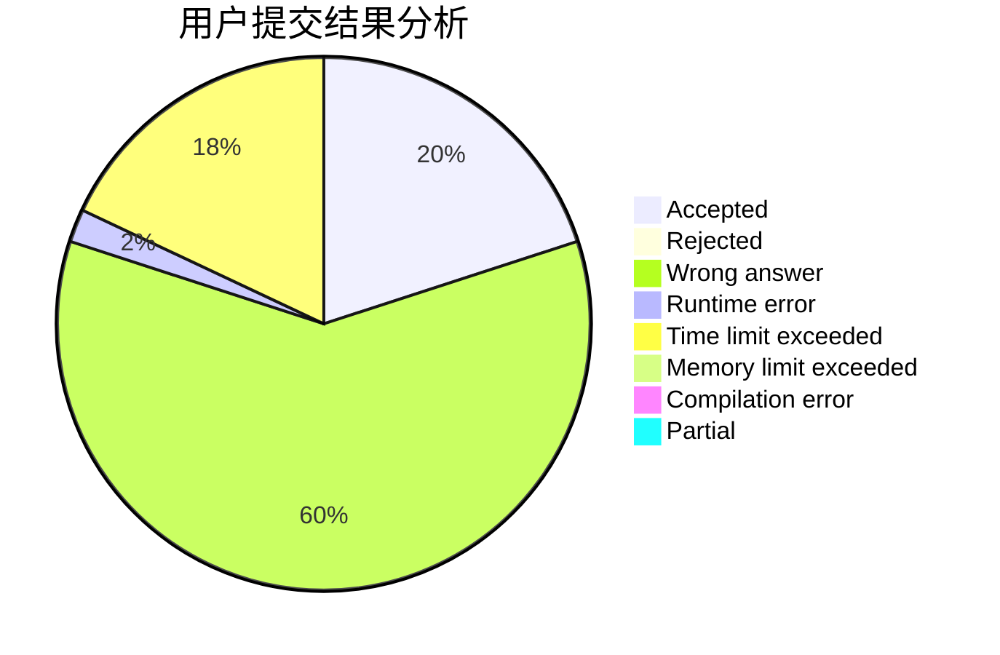
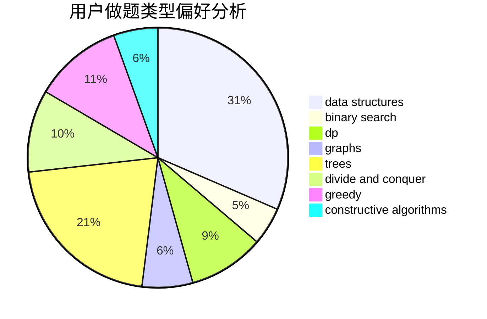
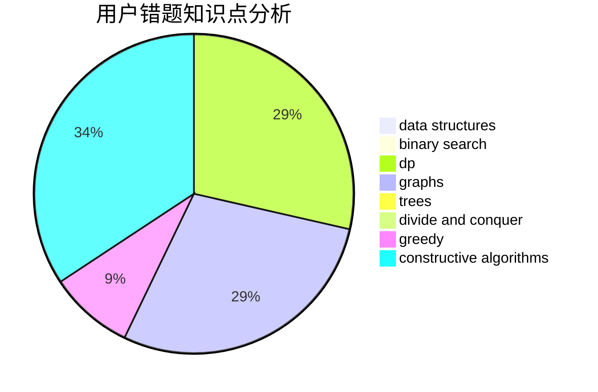

# lucccff

<!-- tabs:start -->

#### **用户提交结果分析**

#### **用户做题类型偏好分析**

#### **用户错题知识点分析**

<!-- tabs:end -->
# 推荐题目
[285E](https://codeforces.com/contest/285/problem/E)		combinatorics,
                        dp,
                        math		  
[39C](https://codeforces.com/contest/39/problem/C)		dp,
                        sortings		  
[44E](https://codeforces.com/contest/44/problem/E)		dp		  
[327A](https://codeforces.com/contest/327/problem/A)		brute force,
                        dp,
                        implementation		  
[38C](https://codeforces.com/contest/38/problem/C)		brute force		  
[297B](https://codeforces.com/contest/297/problem/B)		constructive algorithms,
                        greedy		  
[849A](https://codeforces.com/contest/849/problem/A)		implementation		  
[1039A](https://codeforces.com/contest/1039/problem/A)		constructive algorithms,
                        data structures,
                        greedy,
                        math		  
[501A](https://codeforces.com/contest/501/problem/A)		implementation		  
[660A](https://codeforces.com/contest/660/problem/A)		greedy,
                        implementation,
                        math,
                        number theory		  
