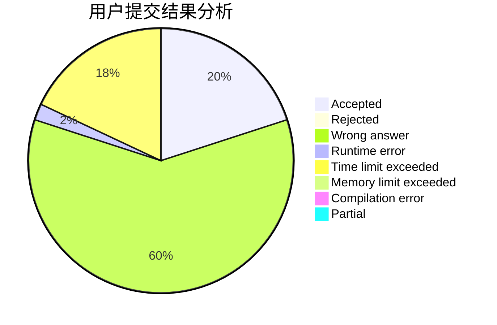
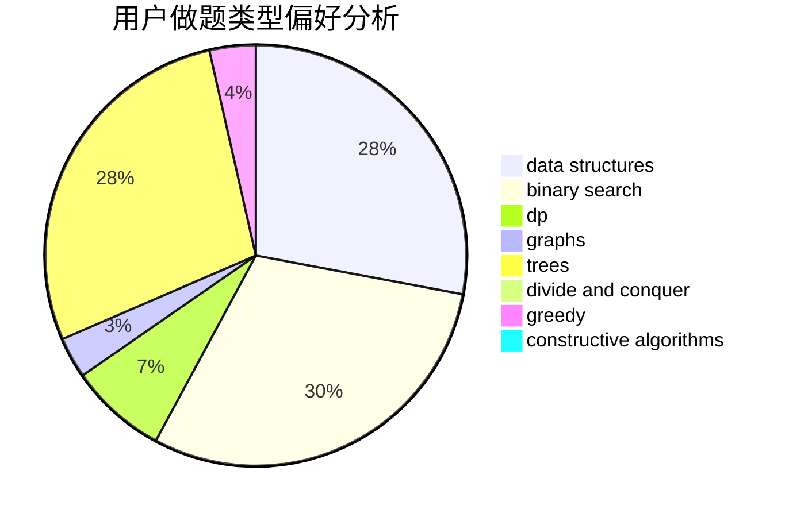
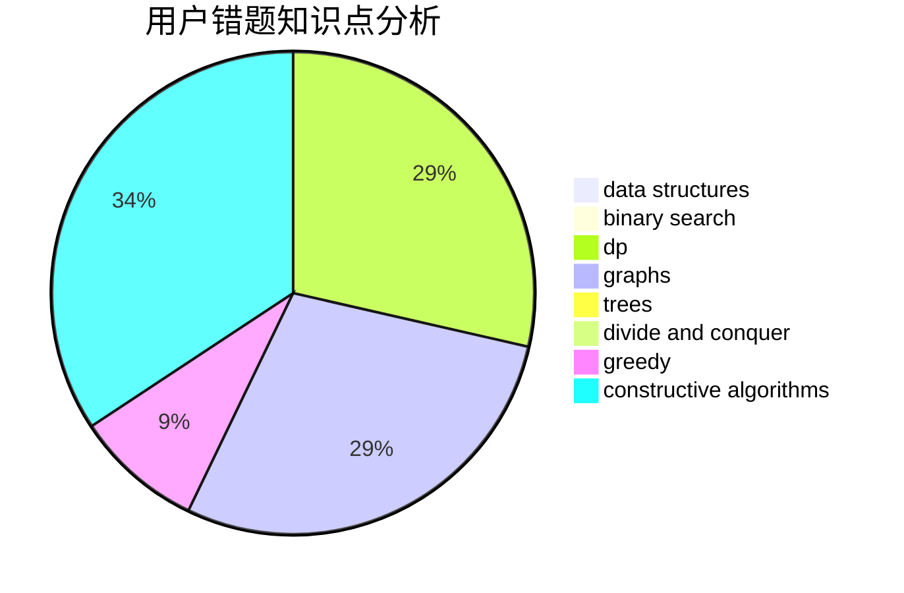

# lucccff

<!-- tabs:start -->

#### **用户提交结果分析**

#### **用户做题类型偏好分析**

#### **用户错题知识点分析**

<!-- tabs:end -->
# 推荐题目
[269D](https://codeforces.com/contest/269/problem/D)		data structures,
                        dp,
                        graphs,
                        sortings		  
[369A](https://codeforces.com/contest/369/problem/A)		greedy,
                        implementation		  
[429A](https://codeforces.com/contest/429/problem/A)		dfs and similar,
                        trees		  
[305D](https://codeforces.com/contest/305/problem/D)		combinatorics,
                        math		  
[363D](https://codeforces.com/contest/363/problem/D)		binary search,
                        greedy		  
[280E](https://codeforces.com/contest/280/problem/E)		data structures,
                        dp,
                        implementation,
                        math		  
[831A](https://codeforces.com/contest/831/problem/A)		implementation		  
[1038C](https://codeforces.com/contest/1038/problem/C)		greedy,
                        sortings		  
[482C](https://codeforces.com/contest/482/problem/C)		bitmasks,
                        dp,
                        probabilities		  
[630C](https://codeforces.com/contest/630/problem/C)		combinatorics,
                        math		  
