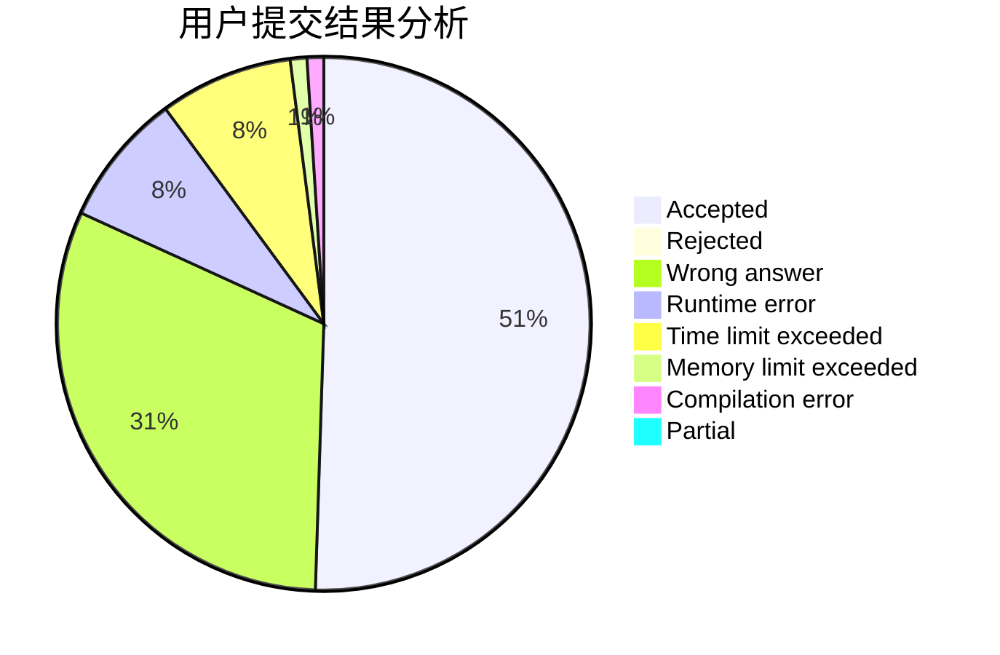
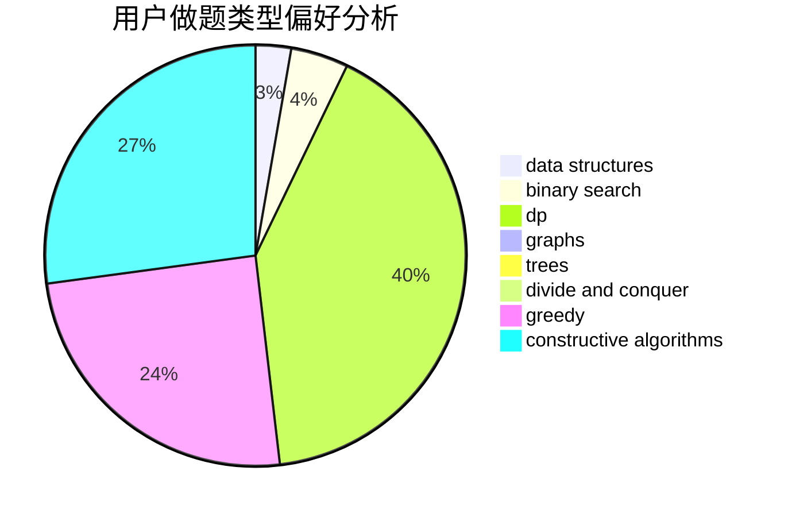
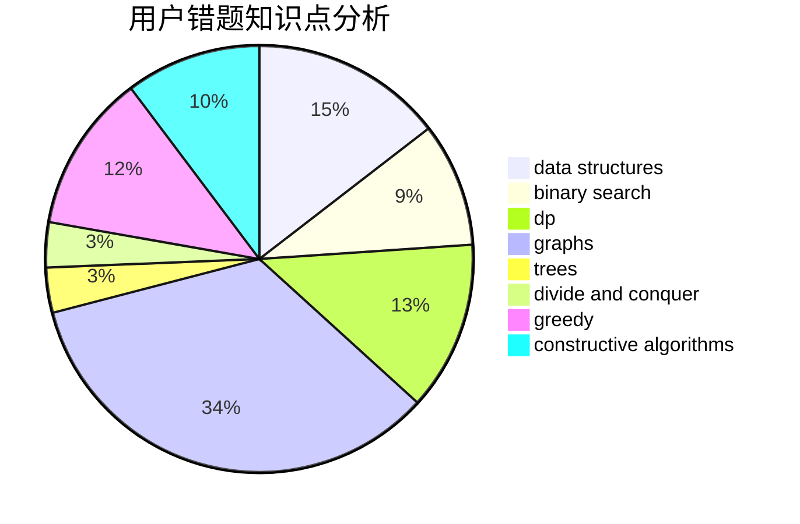

# lucifer1004

<!-- tabs:start -->

#### **用户提交结果分析**

#### **用户做题类型偏好分析**

#### **用户错题知识点分析**

<!-- tabs:end -->
# 推荐题目
[1379B](https://codeforces.com/contest/1379/problem/B)		binary search,
                        brute force,
                        math,
                        number theory		  
[911A](https://codeforces.com/contest/911/problem/A)		implementation		  
[349B](https://codeforces.com/contest/349/problem/B)		data structures,
                        dp,
                        greedy,
                        implementation		  
[1371C](https://codeforces.com/contest/1371/problem/C)		greedy,
                        implementation,
                        math		  
[735A](https://codeforces.com/contest/735/problem/A)		implementation,
                        strings		  
[899B](https://codeforces.com/contest/899/problem/B)		implementation		  
[606A](https://codeforces.com/contest/606/problem/A)		implementation		  
[545E](https://codeforces.com/contest/545/problem/E)		graphs,
                        greedy,
                        shortest paths		  
[1286A](https://codeforces.com/contest/1286/problem/A)		dp,
                        greedy,
                        sortings		  
[1190D](https://codeforces.com/contest/1190/problem/D)		data structures,
                        divide and conquer,
                        sortings,
                        two pointers		  
