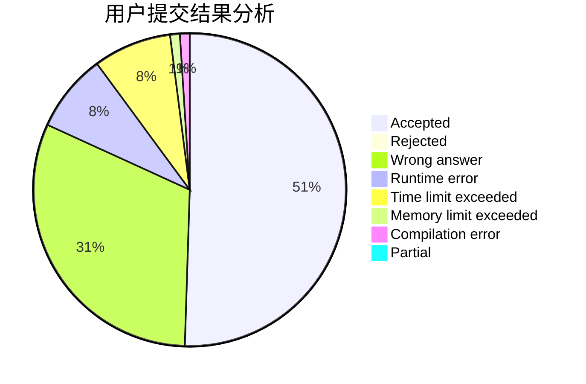
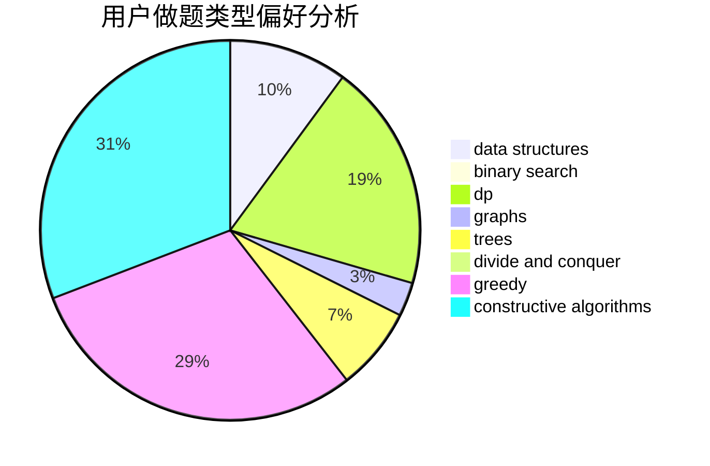
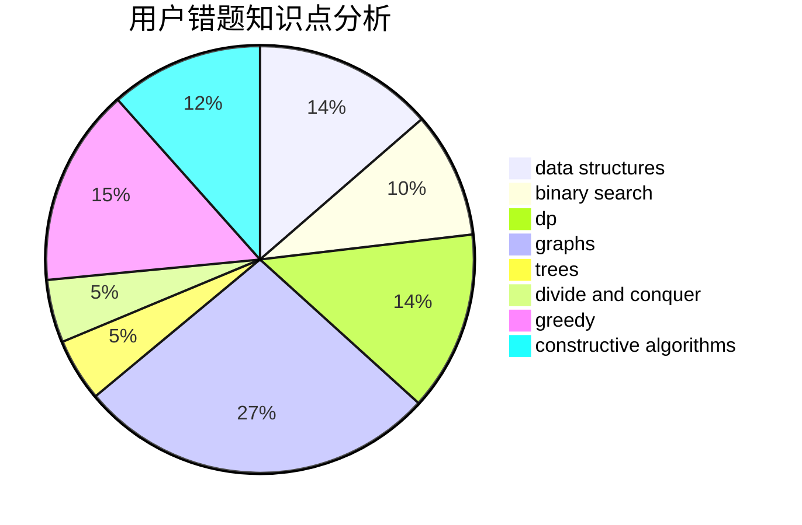

# lucifer1004

<!-- tabs:start -->

#### **用户提交结果分析**

#### **用户做题类型偏好分析**

#### **用户错题知识点分析**

<!-- tabs:end -->
# 推荐题目
[1370E](https://codeforces.com/contest/1370/problem/E)		binary search,
                        constructive algorithms,
                        data structures,
                        greedy		  
[893A](https://codeforces.com/contest/893/problem/A)		implementation		  
[319A](https://codeforces.com/contest/319/problem/A)		combinatorics,
                        math		  
[1364E](https://codeforces.com/contest/1364/problem/E)		bitmasks,
                        constructive algorithms,
                        divide and conquer,
                        interactive,
                        probabilities		  
[717E](https://codeforces.com/contest/717/problem/E)		dfs and similar		  
[878C](https://codeforces.com/contest/878/problem/C)		data structures,
                        graphs		  
[585E](https://codeforces.com/contest/585/problem/E)		combinatorics,
                        math,
                        number theory		  
[520A](https://codeforces.com/contest/520/problem/A)		implementation,
                        strings		  
[1280A](https://codeforces.com/contest/1280/problem/A)		implementation,
                        math		  
[1187B](https://codeforces.com/contest/1187/problem/B)		binary search,
                        implementation,
                        strings		  
