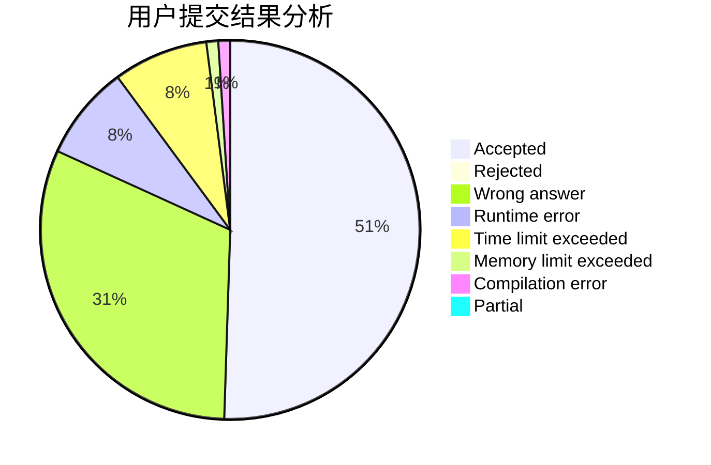
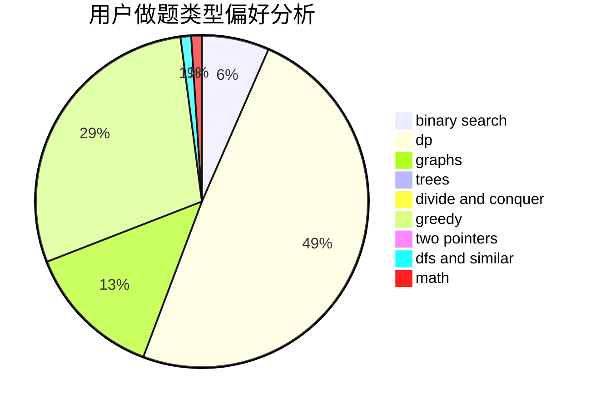

# lucifer1004

<!-- tabs:start -->

#### **用户提交结果分析**

#### **用户做题类型偏好分析**

<!-- tabs:end -->
# 推荐题目
[1379B](https://codeforces.com/contest/1379/problem/B)
[911A](https://codeforces.com/contest/911/problem/A)
[349B](https://codeforces.com/contest/349/problem/B)
[1371C](https://codeforces.com/contest/1371/problem/C)
[735A](https://codeforces.com/contest/735/problem/A)
[899B](https://codeforces.com/contest/899/problem/B)
[606A](https://codeforces.com/contest/606/problem/A)
[545E](https://codeforces.com/contest/545/problem/E)
[1286A](https://codeforces.com/contest/1286/problem/A)
[1190D](https://codeforces.com/contest/1190/problem/D)
