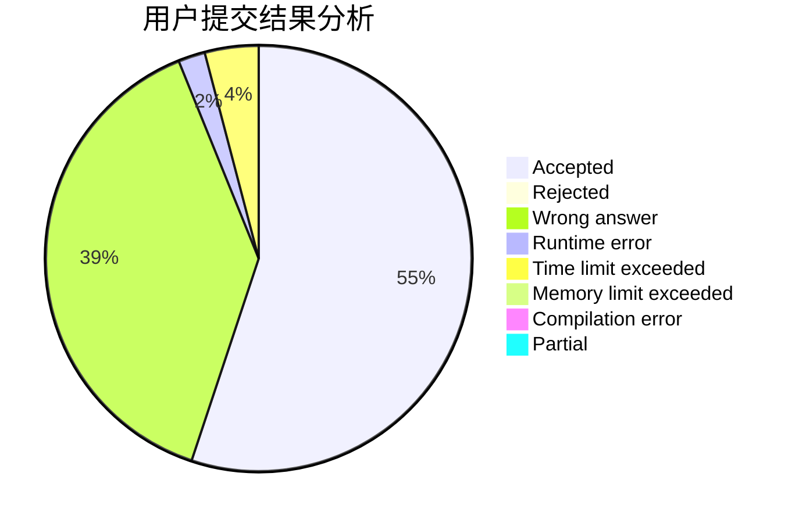
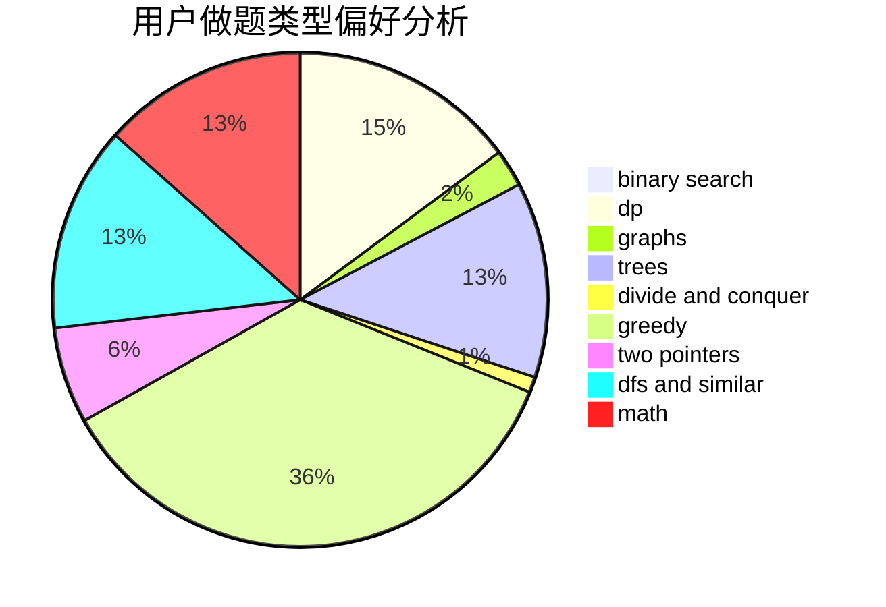

# lucifer1006

<!-- tabs:start -->

#### **用户提交结果分析**

#### **用户做题类型偏好分析**

<!-- tabs:end -->
# 推荐题目
[952E](https://codeforces.com/contest/952/problem/E)
[505B](https://codeforces.com/contest/505/problem/B)
[977A](https://codeforces.com/contest/977/problem/A)
[1225C](https://codeforces.com/contest/1225/problem/C)
[812C](https://codeforces.com/contest/812/problem/C)
[1332A](https://codeforces.com/contest/1332/problem/A)
[612F](https://codeforces.com/contest/612/problem/F)
[356C](https://codeforces.com/contest/356/problem/C)
[114E](https://codeforces.com/contest/114/problem/E)
[496A](https://codeforces.com/contest/496/problem/A)
