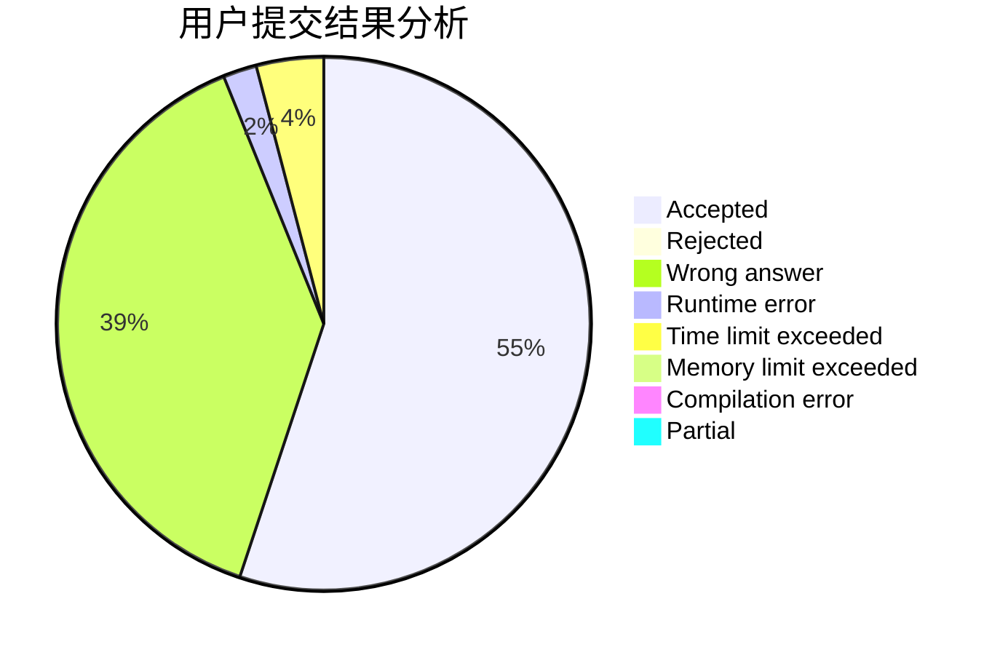
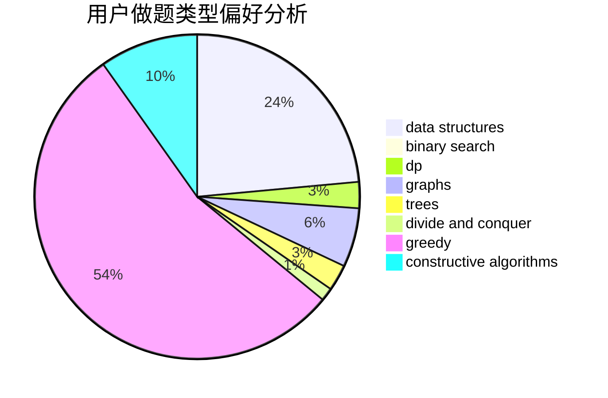
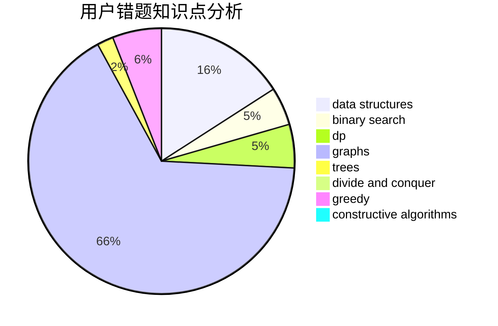

# lucifer1006

<!-- tabs:start -->

#### **用户提交结果分析**

#### **用户做题类型偏好分析**

#### **用户错题知识点分析**

<!-- tabs:end -->
# 推荐题目
[952E](https://codeforces.com/contest/952/problem/E)		nan		  
[505B](https://codeforces.com/contest/505/problem/B)		dfs and similar,
                        dp,
                        dsu,
                        graphs		  
[977A](https://codeforces.com/contest/977/problem/A)		implementation		  
[1225C](https://codeforces.com/contest/1225/problem/C)		bitmasks,
                        brute force,
                        math		  
[812C](https://codeforces.com/contest/812/problem/C)		binary search,
                        sortings		  
[1332A](https://codeforces.com/contest/1332/problem/A)		greedy,
                        implementation,
                        math		  
[612F](https://codeforces.com/contest/612/problem/F)		dp		  
[356C](https://codeforces.com/contest/356/problem/C)		combinatorics,
                        constructive algorithms,
                        greedy,
                        implementation		  
[114E](https://codeforces.com/contest/114/problem/E)		dsu,graphs,sortings,trees		  
[496A](https://codeforces.com/contest/496/problem/A)		brute force,
                        implementation,
                        math		  
