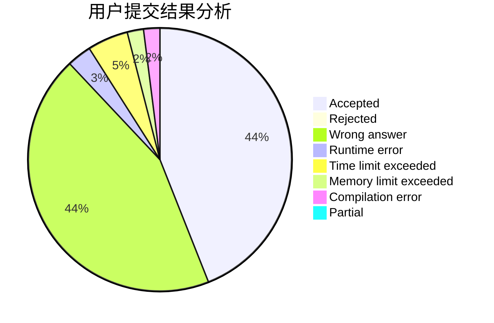
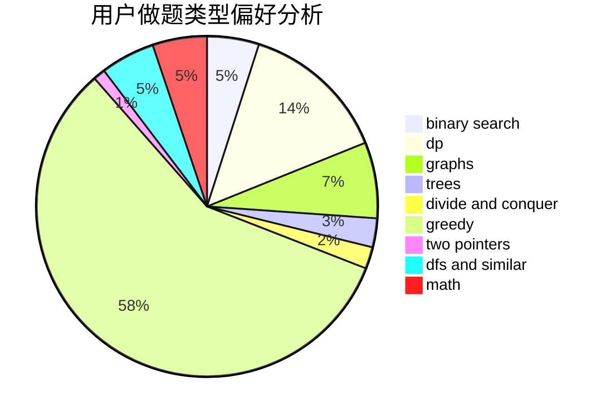

# lucifer17

<!-- tabs:start -->

#### **用户提交结果分析**

#### **用户做题类型偏好分析**

<!-- tabs:end -->
# 推荐题目
[1497B](https://codeforces.com/contest/1497/problem/B)
[286C](https://codeforces.com/contest/286/problem/C)
[545C](https://codeforces.com/contest/545/problem/C)
[354C](https://codeforces.com/contest/354/problem/C)
[821A](https://codeforces.com/contest/821/problem/A)
[1099F](https://codeforces.com/contest/1099/problem/F)
[700D](https://codeforces.com/contest/700/problem/D)
[52B](https://codeforces.com/contest/52/problem/B)
[988D](https://codeforces.com/contest/988/problem/D)
[774C](https://codeforces.com/contest/774/problem/C)
