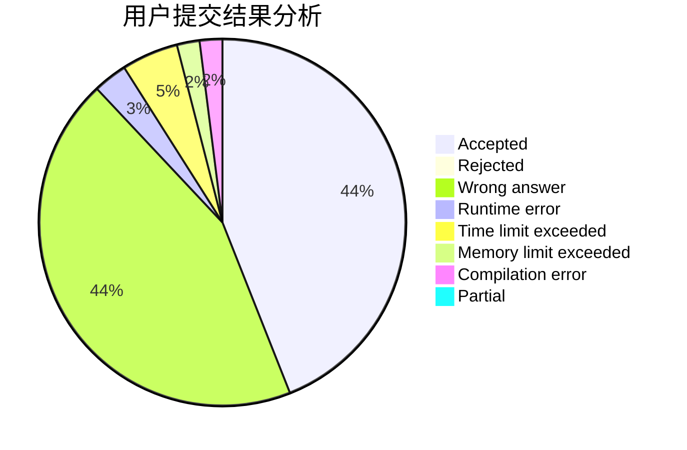
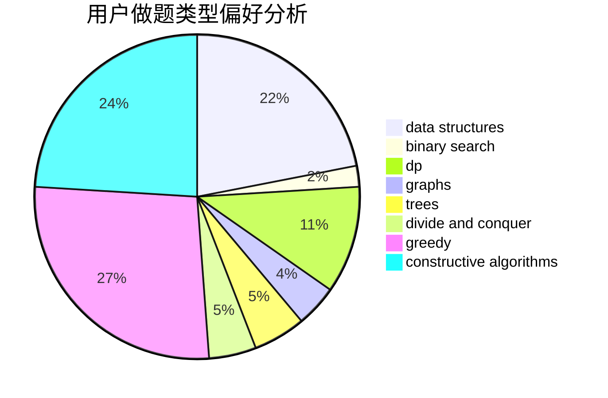
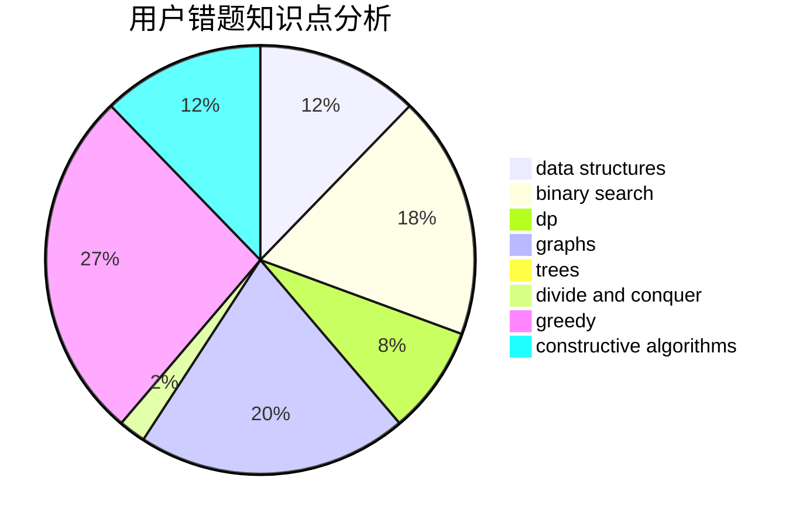

# lucifer17

<!-- tabs:start -->

#### **用户提交结果分析**

#### **用户做题类型偏好分析**

#### **用户错题知识点分析**

<!-- tabs:end -->
# 推荐题目
[1497B](https://codeforces.com/contest/1497/problem/B)		constructive algorithms,
                        greedy,
                        math		  
[286C](https://codeforces.com/contest/286/problem/C)		greedy,
                        implementation		  
[545C](https://codeforces.com/contest/545/problem/C)		dp,
                        greedy		  
[354C](https://codeforces.com/contest/354/problem/C)		brute force,
                        dp,
                        number theory		  
[821A](https://codeforces.com/contest/821/problem/A)		implementation		  
[1099F](https://codeforces.com/contest/1099/problem/F)		binary search,
                        data structures,
                        dfs and similar,
                        dp,
                        games,
                        trees		  
[700D](https://codeforces.com/contest/700/problem/D)		data structures,
                        greedy		  
[52B](https://codeforces.com/contest/52/problem/B)		combinatorics		  
[988D](https://codeforces.com/contest/988/problem/D)		brute force,
                        math		  
[774C](https://codeforces.com/contest/774/problem/C)		*special problem,
                        constructive algorithms,
                        greedy,
                        implementation		  
