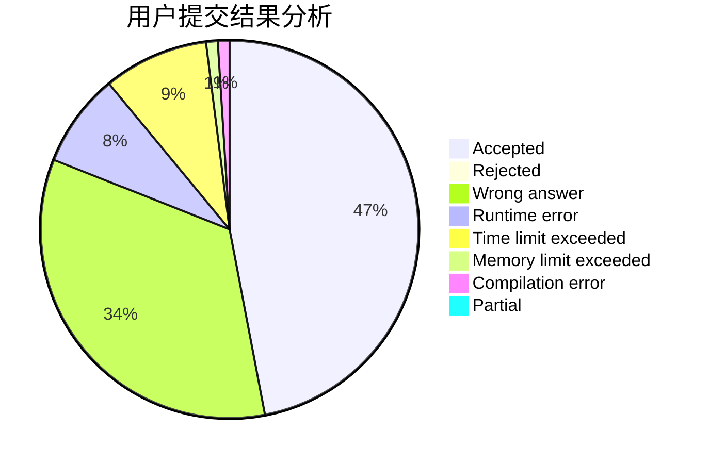
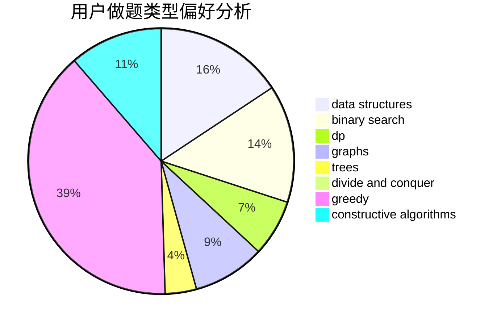
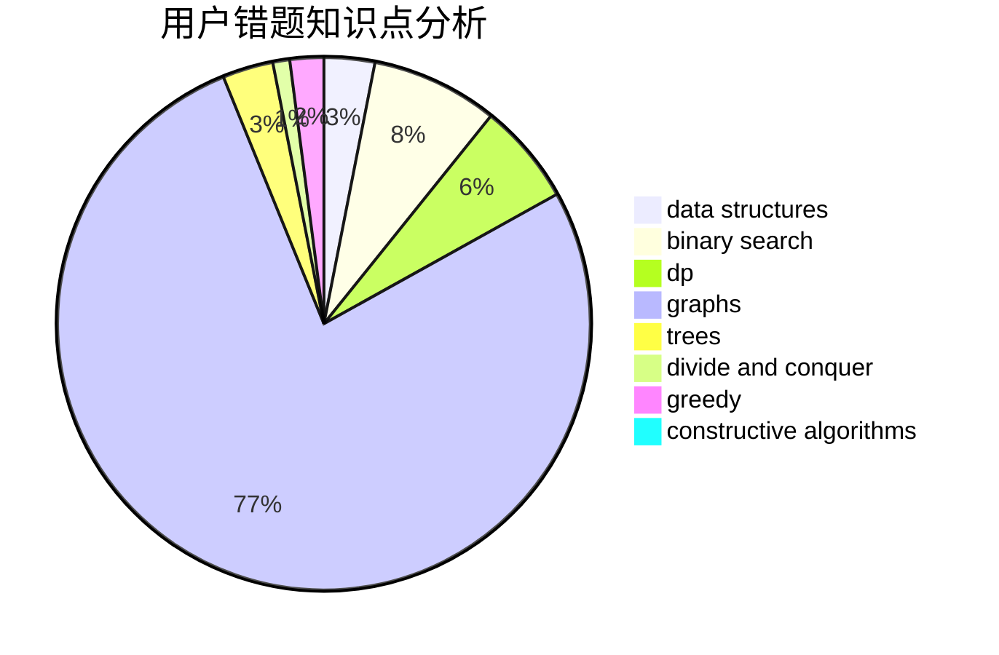

# luckyblock233

<!-- tabs:start -->

#### **用户提交结果分析**

#### **用户做题类型偏好分析**

#### **用户错题知识点分析**

<!-- tabs:end -->
# 推荐题目
[582A](https://codeforces.com/contest/582/problem/A)		constructive algorithms,
                        greedy,
                        number theory		  
[319A](https://codeforces.com/contest/319/problem/A)		combinatorics,
                        math		  
[750G](https://codeforces.com/contest/750/problem/G)		bitmasks,
                        brute force,
                        combinatorics,
                        dp		  
[1214G](https://codeforces.com/contest/1214/problem/G)		bitmasks,
                        data structures		  
[1333E](https://codeforces.com/contest/1333/problem/E)		brute force,
                        constructive algorithms		  
[1373E](https://codeforces.com/contest/1373/problem/E)		brute force,
                        constructive algorithms,
                        dp,
                        greedy		  
[886F](https://codeforces.com/contest/886/problem/F)		geometry		  
[802C](https://codeforces.com/contest/802/problem/C)		flows		  
[765E](https://codeforces.com/contest/765/problem/E)		dfs and similar,
                        dp,
                        greedy,
                        implementation,
                        trees		  
[494C](https://codeforces.com/contest/494/problem/C)		dp,
                        probabilities		  
