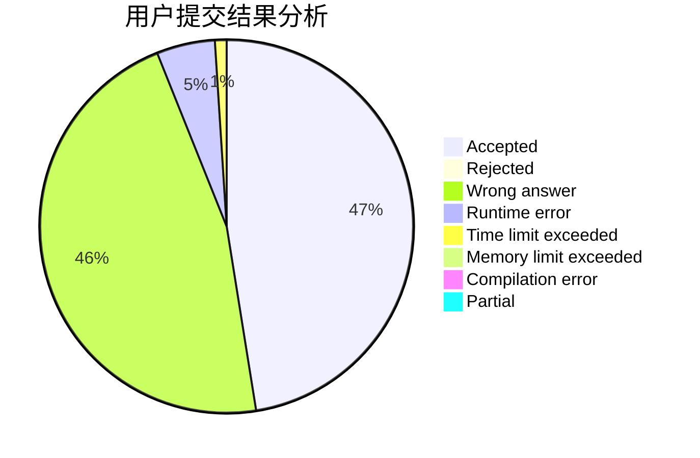
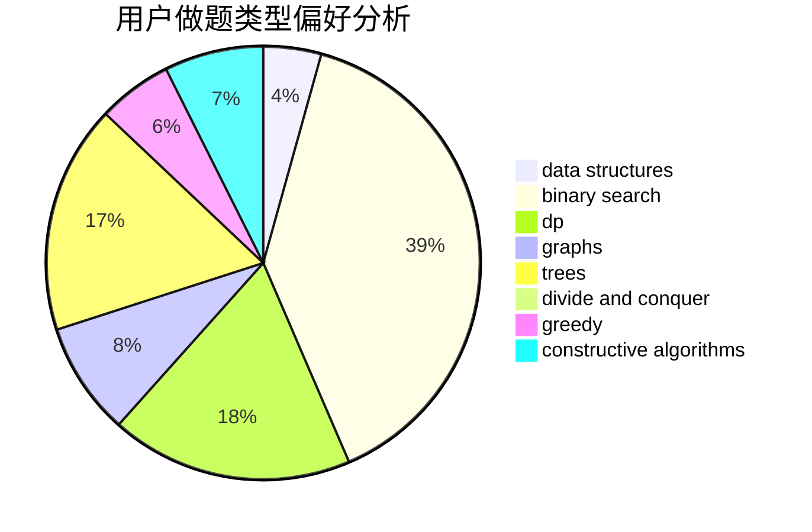
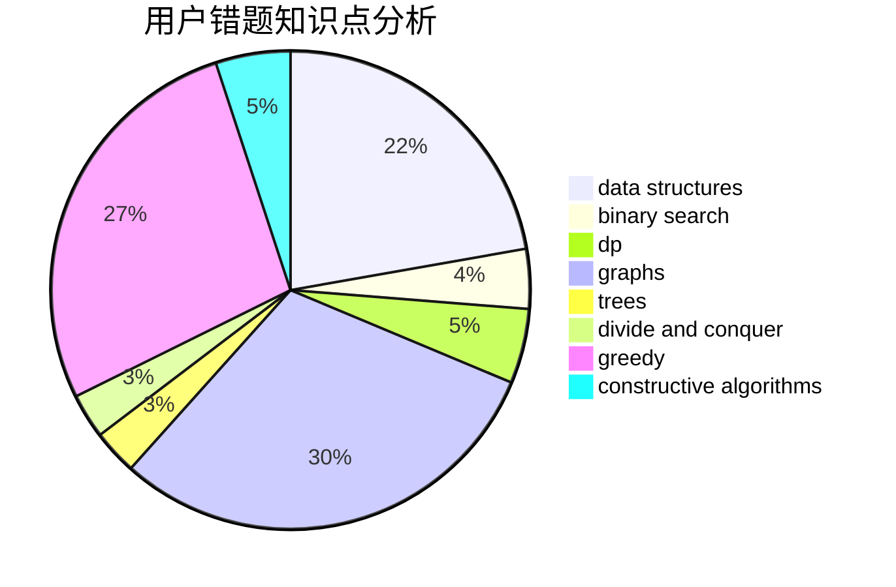

# luohuang

<!-- tabs:start -->

#### **用户提交结果分析**

#### **用户做题类型偏好分析**

#### **用户错题知识点分析**

<!-- tabs:end -->
# 推荐题目
[1279E](https://codeforces.com/contest/1279/problem/E)		combinatorics,
                        dp		  
[380A](https://codeforces.com/contest/380/problem/A)		binary search,
                        brute force		  
[914H](https://codeforces.com/contest/914/problem/H)		combinatorics,
                        dp,
                        games,
                        trees		  
[1017F](https://codeforces.com/contest/1017/problem/F)		brute force,
                        math		  
[49E](https://codeforces.com/contest/49/problem/E)		dp		  
[666C](https://codeforces.com/contest/666/problem/C)		combinatorics,
                        strings		  
[1017E](https://codeforces.com/contest/1017/problem/E)		geometry,
                        hashing,
                        strings		  
[261E](https://codeforces.com/contest/261/problem/E)		brute force,
                        dp,
                        two pointers		  
[1433E](https://codeforces.com/contest/1433/problem/E)		combinatorics,
                        math		  
[314A](https://codeforces.com/contest/314/problem/A)		implementation		  
