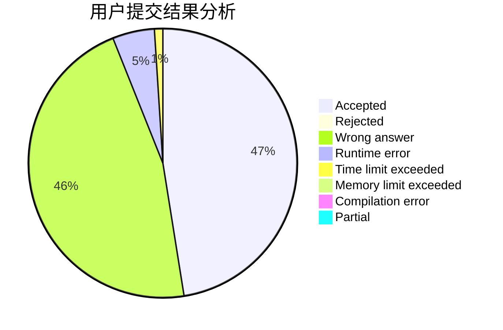
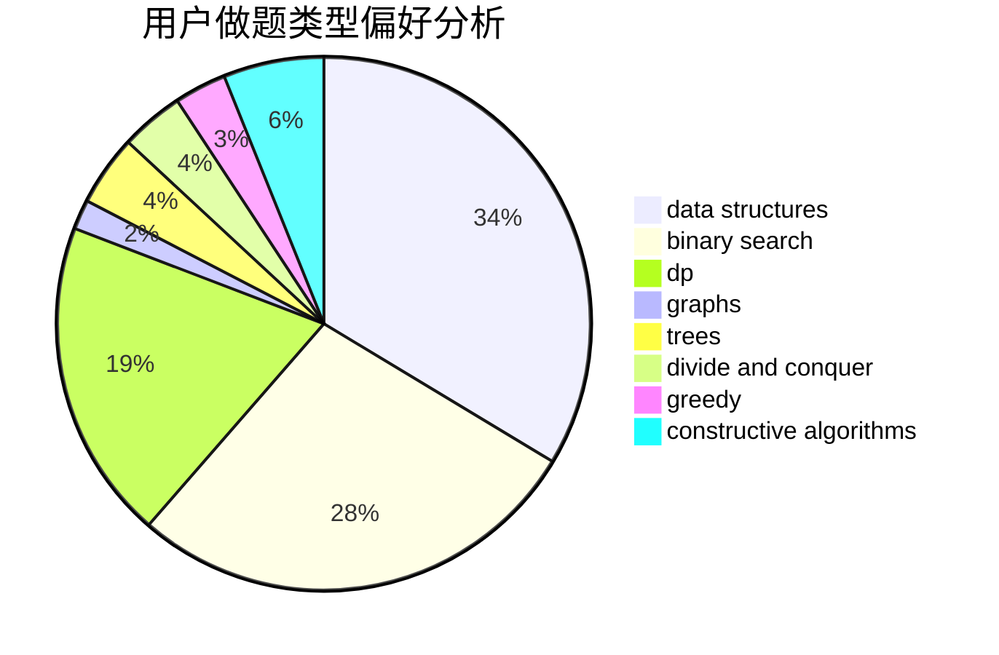
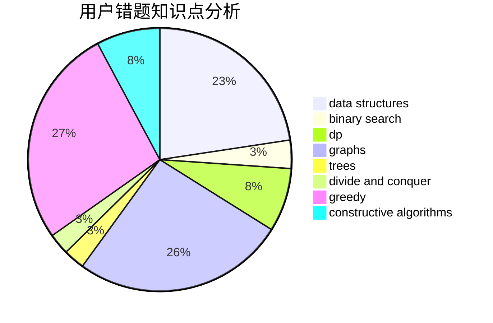

# luohuang

<!-- tabs:start -->

#### **用户提交结果分析**

#### **用户做题类型偏好分析**

#### **用户错题知识点分析**

<!-- tabs:end -->
# 推荐题目
[1270E](https://codeforces.com/contest/1270/problem/E)		constructive algorithms,
                        geometry,
                        math		  
[354B](https://codeforces.com/contest/354/problem/B)		bitmasks,
                        dp,
                        games		  
[898F](https://codeforces.com/contest/898/problem/F)		brute force,
                        hashing,
                        math		  
[1017C](https://codeforces.com/contest/1017/problem/C)		constructive algorithms,
                        greedy		  
[479C](https://codeforces.com/contest/479/problem/C)		greedy,
                        sortings		  
[633H](https://codeforces.com/contest/633/problem/H)		data structures,
                        implementation		  
[1017B](https://codeforces.com/contest/1017/problem/B)		implementation,
                        math		  
[241B](https://codeforces.com/contest/241/problem/B)		binary search,
                        bitmasks,
                        data structures,
                        math		  
[1425B](https://codeforces.com/contest/1425/problem/B)		divide and conquer,
                        dp		  
[297B](https://codeforces.com/contest/297/problem/B)		constructive algorithms,
                        greedy		  
