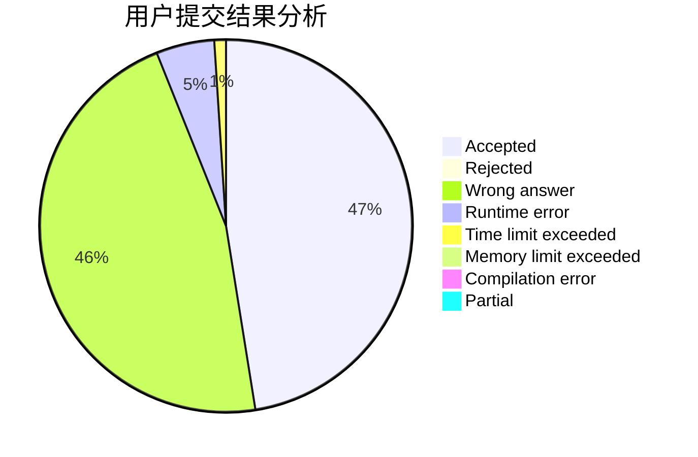
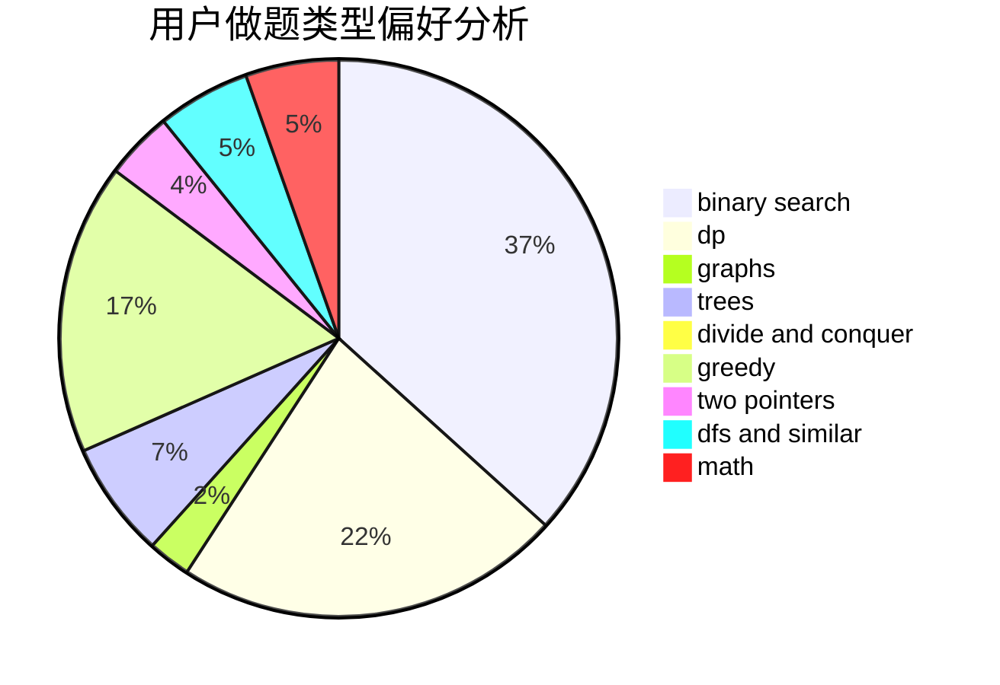

# luohuang

<!-- tabs:start -->

#### **用户提交结果分析**

#### **用户做题类型偏好分析**

<!-- tabs:end -->
# 推荐题目
[1279E](https://codeforces.com/contest/1279/problem/E)
[380A](https://codeforces.com/contest/380/problem/A)
[914H](https://codeforces.com/contest/914/problem/H)
[1017F](https://codeforces.com/contest/1017/problem/F)
[49E](https://codeforces.com/contest/49/problem/E)
[666C](https://codeforces.com/contest/666/problem/C)
[1017E](https://codeforces.com/contest/1017/problem/E)
[261E](https://codeforces.com/contest/261/problem/E)
[1433E](https://codeforces.com/contest/1433/problem/E)
[314A](https://codeforces.com/contest/314/problem/A)
