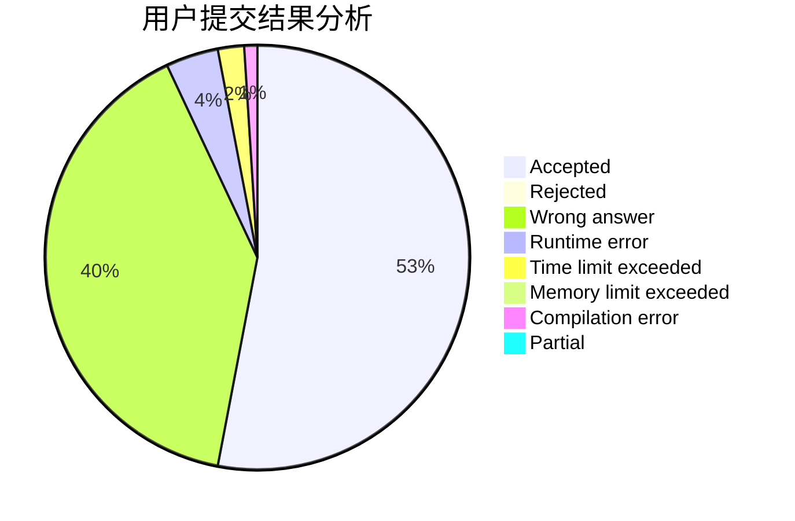
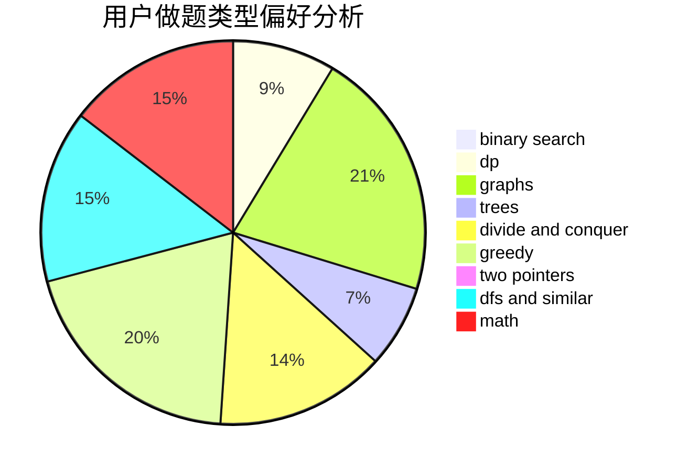

# luyuchen

<!-- tabs:start -->

#### **用户提交结果分析**

#### **用户做题类型偏好分析**

<!-- tabs:end -->
# 推荐题目
[1422F](https://codeforces.com/contest/1422/problem/F)
[9B](https://codeforces.com/contest/9/problem/B)
[1102A](https://codeforces.com/contest/1102/problem/A)
[1228B](https://codeforces.com/contest/1228/problem/B)
[822B](https://codeforces.com/contest/822/problem/B)
[689D](https://codeforces.com/contest/689/problem/D)
[1334G](https://codeforces.com/contest/1334/problem/G)
[1009C](https://codeforces.com/contest/1009/problem/C)
[1023G](https://codeforces.com/contest/1023/problem/G)
[13791](https://codeforces.com/contest/1379/problem/1)
