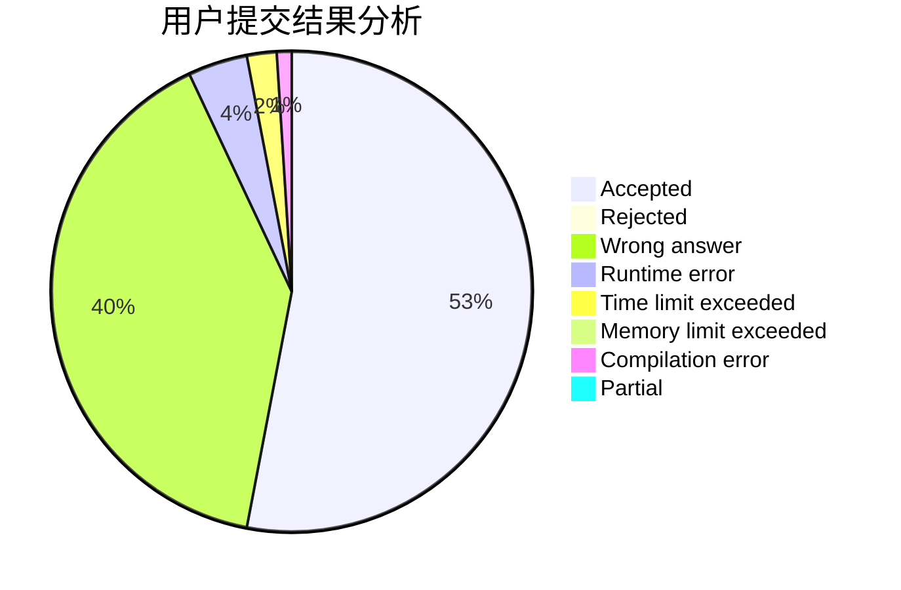
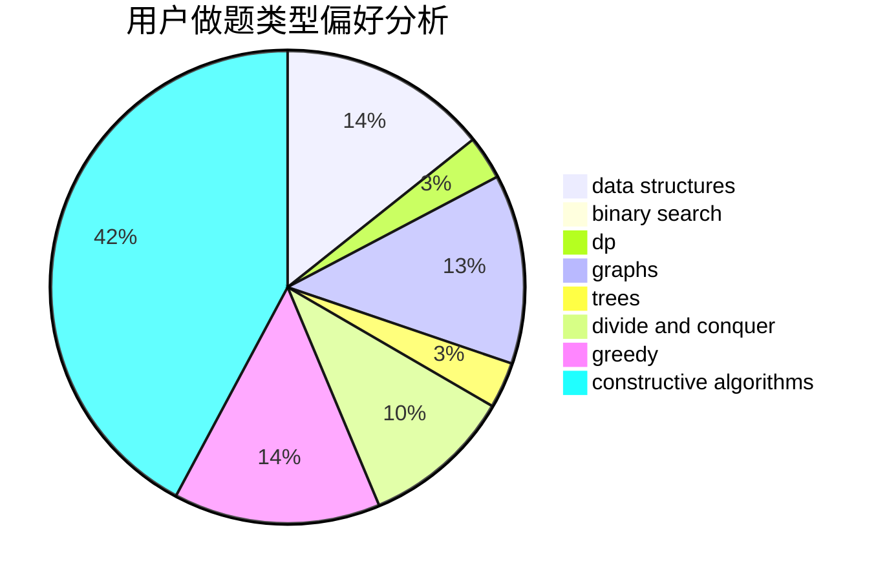

# luyuchen

<!-- tabs:start -->

#### **用户提交结果分析**

#### **用户做题类型偏好分析**

#### **用户错题知识点分析**

<!-- tabs:end -->
# 推荐题目
[1422F](https://codeforces.com/contest/1422/problem/F)		data structures,
                        math,
                        number theory		  
[9B](https://codeforces.com/contest/9/problem/B)		brute force,
                        geometry,
                        implementation		  
[1102A](https://codeforces.com/contest/1102/problem/A)		math		  
[1228B](https://codeforces.com/contest/1228/problem/B)		implementation,
                        math		  
[822B](https://codeforces.com/contest/822/problem/B)		brute force,
                        implementation,
                        strings		  
[689D](https://codeforces.com/contest/689/problem/D)		binary search,
                        data structures		  
[1334G](https://codeforces.com/contest/1334/problem/G)		bitmasks,
                        brute force,
                        fft		  
[1009C](https://codeforces.com/contest/1009/problem/C)		greedy,
                        math		  
[1023G](https://codeforces.com/contest/1023/problem/G)		data structures,
                        flows,
                        trees		  
[13791](https://codeforces.com/contest/1379/problem/1)		dsu,graphs,sortings,trees		  
